<div align="center">


<br/>
<br/>

# 🚀 OmniRoute — The Free AI Gateway



</div>

<div align="center">

## 💰 ~1.62B Free Tokens / Month

</div>

> Stacking free tiers by hand is painful — dozens of SDKs, dozens of rate limits, and no idea how much you actually have. OmniRoute catalogs **489 free-tier entries across 35 recurring pool keys** and computes the token headline from the **17 pools with a published positive monthly budget plus five per-model Groq caps**, deduplicated by shared pool. Quotas that only open after a regional identity check (today: ModelScope) are shown apart, +~6M behind regional identity verification, and never summed into the headline. The result stays visible on the dashboard (`/dashboard/free-tiers`).


> Animated summary of the live `/dashboard/free-tiers` page. Full methodology (pool dedupe, credit tiers, provider terms): **[docs/reference/FREE_TIERS.md](docs/reference/FREE_TIERS.md)**.
>
> <sub>These figures are re-audited every two weeks against the live catalog and **move both ways** — a provider ends a free tier and the number drops; a new one lands and it climbs. We publish what the catalog actually computes, never a rounded-up best case.</sub>

<br/>

<div align="center">

<h3>

⭐ Star the repo if OMNIROUTE helped you save money and make your work easier.

</h3>

[](https://github.com/diegosouzapw/OmniRoute)
<a href="https://trendshift.io/repositories/23589" target="_blank"></a>
[](https://www.star-history.com/diegosouzapw/omniroute)
[](https://olud.ai/project/diegosouzapw-omniroute.html)

### 💬 Join the community

**👋 Follow the maintainer — get new providers, releases & tips first:**

[](https://www.linkedin.com/in/diegosouzapw/)
[](https://github.com/diegosouzapw)

[](https://discord.gg/U47eFqAXCn)
[](https://t.me/omnirouteOficial)
[](https://chat.whatsapp.com/FvuCbrpZmQ6I85n2vW5QIC?s=cl&p=a&mlu=4)
[](https://chat.whatsapp.com/KWgatljAjmbELQory59Oti?s=cl&p=a&mlu=4)
[](https://omniroute.online)

**Questions, provider tips, roadmap & support → [Discord](https://discord.gg/U47eFqAXCn) · [Telegram](https://t.me/omnirouteOficial) · WhatsApp [🌍 Global](https://chat.whatsapp.com/FvuCbrpZmQ6I85n2vW5QIC?s=cl&p=a&mlu=4) / [🇧🇷 Brasil](https://chat.whatsapp.com/KWgatljAjmbELQory59Oti?s=cl&p=a&mlu=4) / [Portal](https://portal.sthub.com.br/communities/groups/st-hub/channels/Omniroute-World-8kRjmK)**

<br/>

## 📈 The Gateway Keeps Growing

<div align="center">

|                           | v3.8.49 |        **v3.8.50**        | `v3.8.51+`  |
| ------------------------- | :-----: | :-----------------------: | :---------: |
| 🌐 Providers              |   290   |          **357**          | more queued |
| 🧠 Unique chat model IDs  |  1185   |         **1312**          |      —      |
| 🖼️ Modality Bridge        |    —    | 🆕 vision + audio + video |      —      |
| 📡 Radar free catalog     |    —    |         🆕 opt-in         |      —      |
| ⚖️ Quota-aware scheduling |    —    |      🆕 Quota-Share       |      —      |
| 📊 Quota telemetry        |    —    |          🆕 live          |      —      |

**→ [Roadmap](ROADMAP.md) — riding the rail to `v3.9.0 LTS`**

</div>

<br/>

## 🧩 Available

[](https://www.npmjs.com/package/omniroute)

[](https://hub.docker.com/r/diegosouzapw/omniroute)
[](LICENSE)


<table>
  <tr>
    <td align="right"><b>🚀 Start</b></td>
    <td align="center"><a href="#-quick-start">🚀 Quick Start</a></td>
    <td align="center"><a href="#-more-install-methods--docker-source-pnpm-arch">📦 Install</a></td>
    <td align="center"><a href="#-works-the-second-you-install-it--no-keys-no-config">🆓 Zero-config</a></td>
  </tr>
  <tr>
    <td align="right"><b>💡 Learn</b></td>
    <td align="center"><a href="#-the-promise">💥 The Promise</a></td>
    <td align="center"><a href="#-why-omniroute">🤔 Why OmniRoute</a></td>
    <td align="center"><a href="#-what-sets-omniroute-apart">🏆 What Sets Apart</a></td>
  </tr>
  <tr>
    <td align="right"><b>⚙️ Features</b></td>
    <td align="center"><a href="#-combos--the-flagship">🎯 Combos</a></td>
    <td align="center"><a href="#-357-ai-providers--152-catalog-marked-free">🌐 Providers</a></td>
    <td align="center"><a href="#-full-cli--a2a--mcp">🔌 CLI &amp; MCP</a></td>
  </tr>
  <tr>
    <td align="right"></td>
    <td align="center"><a href="#%EF%B8%8F-save-1595-tokens--automatically">🗜️ Compression</a></td>
    <td align="center"><a href="#%EF%B8%8F-where-omniroute-runs--anywhere">🖥️ Where It Runs</a></td>
    <td align="center"><a href="#-private--local-first">🔒 Private</a></td>
  </tr>
  <tr>
    <td align="right"><b>👀 See it</b></td>
    <td align="center"><a href="#-omniroute-in-action">🎬 In Action</a></td>
    <td align="center"><a href="#-whats-new">✨ What's New</a></td>
    <td align="center"><a href="#-compatible-clis--coding-agents">🤖 Compatible CLIs</a></td>
  </tr>
  <tr>
    <td align="right"><b>💚 Support</b></td>
    <td align="center"><a href="#-support-omniroute">💚 Support / Donate</a></td>
    <td align="center"><a href="#-community--help">💬 Community</a></td>
    <td align="center"><a href="#-sponsors">💖 Sponsors</a></td>
  </tr>
  <tr>
    <td align="right"><b>📦 Project</b></td>
    <td align="center"><a href="#%EF%B8%8F-tech-stack">🛠️ Tech Stack</a></td>
    <td align="center"><a href="#-documentation">📖 Docs</a></td>
    <td align="center"><a href="#-600-contributors">👥 Contributors</a></td>
  </tr>
</table>

</div>

<div align="center">
  <b>🌐 In 67 languages</b>
  <br/><br/>
  <a href="README.md"></a>
  <a href="docs/i18n/pt-BR/README.md"></a>
  <a href="docs/i18n/pt/README.md"></a>
  <a href="docs/i18n/es/README.md"></a>
  <a href="docs/i18n/fr/README.md"></a>
  <a href="docs/i18n/it/README.md"></a>
  <a href="docs/i18n/de/README.md"></a>
  <a href="docs/i18n/nl/README.md"></a>
  <a href="docs/i18n/ru/README.md"></a>
  <a href="docs/i18n/uk-UA/README.md"></a>
  <a href="docs/i18n/pl/README.md"></a>
  <a href="docs/i18n/cs/README.md"></a>
  <a href="docs/i18n/sk/README.md"></a>
  <a href="docs/i18n/ro/README.md"></a>
  <a href="docs/i18n/hu/README.md"></a>
  <a href="docs/i18n/bg/README.md"></a>
  <a href="docs/i18n/da/README.md"></a>
  <a href="docs/i18n/fi/README.md"></a>
  <a href="docs/i18n/no/README.md"></a>
  <a href="docs/i18n/sv/README.md"></a>
  <a href="docs/i18n/zh-CN/README.md"></a>
  <a href="docs/i18n/zh-TW/README.md"></a>
  <a href="docs/i18n/ja/README.md"></a>
  <a href="docs/i18n/ko/README.md"></a>
  <a href="docs/i18n/th/README.md"></a>
  <a href="docs/i18n/vi/README.md"></a>
  <a href="docs/i18n/id/README.md"></a>
  <a href="docs/i18n/ms/README.md"></a>
  <a href="docs/i18n/phi/README.md"></a>
  <a href="docs/i18n/hi/README.md"></a>
  <a href="docs/i18n/gu/README.md"></a>
  <a href="docs/i18n/mr/README.md"></a>
  <a href="docs/i18n/ta/README.md"></a>
  <a href="docs/i18n/te/README.md"></a>
  <a href="docs/i18n/bn/README.md"></a>
  <a href="docs/i18n/ur/README.md"></a>
  <a href="docs/i18n/fa/README.md"></a>
  <a href="docs/i18n/ar/README.md"></a>
  <a href="docs/i18n/he/README.md"></a>
  <a href="docs/i18n/tr/README.md"></a>
  <a href="docs/i18n/az/README.md"></a>
  <a href="docs/i18n/sw/README.md"></a>
  <a href="docs/i18n/el/README.md"></a>
  <a href="docs/i18n/hr/README.md"></a>
  <a href="docs/i18n/sr/README.md"></a>
  <a href="docs/i18n/lt/README.md"></a>
  <a href="docs/i18n/et/README.md"></a>
  <a href="docs/i18n/lv/README.md"></a>
  <a href="docs/i18n/sl/README.md"></a>
  <a href="docs/i18n/mt/README.md"></a>
  <a href="docs/i18n/ga/README.md"></a>
  <a href="docs/i18n/kn/README.md"></a>
  <a href="docs/i18n/ml/README.md"></a>
  <a href="docs/i18n/or/README.md"></a>
  <a href="docs/i18n/pa/README.md"></a>
  <a href="docs/i18n/ne/README.md"></a>
  <a href="docs/i18n/si/README.md"></a>
  <a href="docs/i18n/my/README.md"></a>
  <a href="docs/i18n/km/README.md"></a>
  <a href="docs/i18n/ha/README.md"></a>
  <a href="docs/i18n/yo/README.md"></a>
  <a href="docs/i18n/ig/README.md"></a>
  <a href="docs/i18n/am/README.md"></a>
  <a href="docs/i18n/uz/README.md"></a>
  <a href="docs/i18n/ka/README.md"></a>
  <a href="docs/i18n/hy/README.md"></a>
  <a href="docs/i18n/bs/README.md"></a>
</div>

<br/>
<br/>

<div align="center">

## 🆓 Works the second you install it — no keys, no config

</div>


```bash
# Fresh install, zero credentials — `auto` already works:
curl http://localhost:20128/v1/chat/completions \
  -H "Content-Type: application/json" \
  -d '{"model":"auto","messages":[{"role":"user","content":"Hello!"}]}'
```

<sub>Prefer a specific free backend? Call `oc/…` (OpenCode Free) directly. Then graduate to `auto` and let OmniRoute pick.</sub>

<sub>📦 Copy-paste quickstart scripts for **Python, Node.js, PHP, and cURL** → [`examples/quickstart/`](examples/quickstart/)</sub>

<br/>

<div align="center">

# 💥 The Promise

</div>


<br/>
<br/>

<div align="center">

# 🤔 Why OmniRoute?

</div>


<div align="center">


</div>

<br/>

<div align="center">

## 🤝 Supported by our Open Source Friends

</div>

<p align="center">
  <a href="https://platform.kimi.ai?track_id=track-8197581fdd7d4139a0f562e4a03c3798&aff=omniroute">
    
  </a>
</p>

> **Want to join as an Open Source Friend?** These are the companies that back open source and help keep OmniRoute moving — and we say publicly where every token they give us goes. Reach out: [diegosouza.pw@outlook.com](mailto:diegosouza.pw@outlook.com)

<table>
  <tr>
    <td align="center" width="150">
      <a href="https://platform.kimi.ai?track_id=track-8197581fdd7d4139a0f562e4a03c3798&aff=omniroute">
        <picture>
          <source media="(prefers-color-scheme: dark)" srcset="public/providers/kimi-logomark-dark.svg">
          
        </picture>
      </a>
      <br/><b>Kimi</b><br/><sub>Moonshot AI</sub><br/><br/>
      
    </td>
    <td>
      Thanks to <b>Kimi (Moonshot AI)</b>, our founding Open Source Friend, for backing this project! Kimi is the AI lab behind the open-weight K2 and K3 model families — <b>Kimi K3</b> delivers a 1M-token context window, native vision and frontier-level coding at a fraction of closed-model prices, and works out of the box with Claude Code, Codex and every coding tool OmniRoute serves.
      <br/><br/>
      <b>What Kimi's support powers:</b> Kimi's API credits power OmniRoute's AI-validated release pipeline — the <i>merge validation powered by Kimi K3</i> stage that reviews every pull request before it ships — plus day-to-day feature development. First-class Kimi support ships on both rails: the direct <a href="https://platform.kimi.ai?track_id=track-8197581fdd7d4139a0f562e4a03c3798&aff=omniroute">Kimi API</a> (<code>kimi-k3</code>) and the <a href="https://www.kimi.com/code?aff=omniroute">Kimi Code coding plan</a> (OAuth and API key). OmniRoute is also the first Brazilian open-source project in Kimi's support program. <a href="https://platform.kimi.ai?track_id=track-8197581fdd7d4139a0f562e4a03c3798&aff=omniroute"><b>Get a Kimi API key with 15% extra credits →</b></a>
    </td>
  </tr>
  <tr>
    <td align="center" width="150">
      <a href="https://cheaperinference.com/?utm_source=omniroute">
        
      </a>
      <br/><b>Cheaper Inference</b><br/><sub>cheaperinference.com</sub><br/><br/>
      
    </td>
    <td>
      Thanks to <b>Cheaper Inference</b>, an OmniRoute Open Source Friend, for backing this project! Cheaper Inference is a cost-ranked gateway that resells 42 frontier models — Claude, GPT-5.x, Gemini, Kimi K3, GLM, DeepSeek, Grok and MiniMax — behind one OpenAI-compatible endpoint, routing each request to the cheapest eligible provider without ever charging above the model maker's list price.
      <br/><br/>
      <b>First-class support in OmniRoute:</b> Chat Completions, the native <code>/v1/responses</code> endpoint, vision, tool calling and 3 image models (<code>grok-imagine</code>, <code>nano-banana-pro</code>, <code>nano-banana-2</code>, reachable as <code>cheaperinference/&lt;model&gt;</code>). <a href="https://cheaperinference.com/?utm_source=omniroute"><b>Get an API key →</b></a>
    </td>
  </tr>
</table>

<sub>Links tagged <code>aff=omniroute</code> are partner links. They fund the project at no extra cost to you.</sub>

<br/>

<details open>
<summary><sub><b>🎟️ Affiliates Promo</b> — free signup coupons from providers we don't sponsor (click to expand)</sub></summary>

<sub><i>This section is for referral/coupon codes only. Sponsored partnerships live in <b>🤝 Supported by our Open Source Friends</b> above. OmniRoute has no sponsorship or partnership with the providers listed here — these are public coupons anyone can use.</i></sub>

<table>
  <tr>
    <td align="center" width="120">
      <a href="https://agentrouter.org/register?aff=70LM">
        
      </a>
      <br/><sub><b>AgentRouter</b></sub><br/><sub>agentrouter.org</sub>
    </td>
    <td>
      <sub><b><a href="https://agentrouter.org/register?aff=70LM">AgentRouter</a></b> — affiliate signup · <b>$100 free credits</b> on signup (free server, expect higher latency — best for testing, not production). First-class support in OmniRoute since <b>v3.8.50</b>: Chat Completions, the Anthropic-compatible wire format and the OpenAI-compatible path. Available models include <code>claude-opus-4-8</code>, <code>claude-opus-5</code>, <code>gpt-5.6-sol</code> and more. <b><a href="https://agentrouter.org/register?aff=70LM">Grab your $100 →</a></b></sub>
      <br/><br/>
      <sub>⚠️ <i>Affiliate link — OmniRoute has no sponsorship or partnership with this provider.</i></sub>
    </td>
  </tr>
</table>

<sub>Know another provider with a generous free signup coupon that benefits OmniRoute users? Open an issue and we'll add it here.</sub>

</details>

<br/>

<div align="center">

## 🎯 Combos — The Flagship

</div>


> A **combo** is a chain of models OmniRoute routes across **automatically**. If quota runs out, a provider fails, or costs spike, the combo can move to the next eligible healthy model. 🛡️

### ⚡ Zero-config — just use `auto`

No combo to create. Set your model to `auto` (or a variant) and OmniRoute builds a virtual combo from your connected providers, scored live:

<table>
  <tr><th align="left">Model ID</th><th align="left">What it optimizes for</th></tr>
  <tr><td align="left" nowrap><code>auto</code></td><td align="left">🎯 Balanced default (LKGP — sticks to your last good provider)</td></tr>
  <tr><td align="left" nowrap><code>auto/coding</code></td><td align="left">🧑‍💻 Quality-first weights for code generation</td></tr>
  <tr><td align="left" nowrap><code>auto/fast</code></td><td align="left">⚡ Lowest latency first</td></tr>
  <tr><td align="left" nowrap><code>auto/cheap</code></td><td align="left">💰 Cheapest per token first</td></tr>
  <tr><td align="left" nowrap><code>auto/offline</code></td><td align="left">🔋 Most quota / rate-limit headroom first</td></tr>
  <tr><td align="left" nowrap><code>auto/smart</code></td><td align="left">🔭 Quality-first + 10% exploration to discover better models</td></tr>
  <tr><td align="left" nowrap><code>auto/lkgp</code></td><td align="left">📌 Explicit last-known-good-provider stickiness</td></tr>
  <tr><td align="left" nowrap><code>auto/chaos</code></td><td align="left">🧪 Fault-injection weights for resilience testing (chaos engineering)</td></tr>
</table>

##

### 🔀 Or build your own — 19 routing strategies

All **19** strategies — mix & match per combo step:

<table>
  <tr>
    <th>#</th>
    <th align="left">Strategy</th>
    <th align="left">What it does</th>
  </tr>
  <tr>
    <td align="center">1</td>
    <td nowrap><code>priority</code></td>
    <td>First-target ordered list — drain each before the next 🥇</td>
  </tr>
  <tr>
    <td align="center">2</td>
    <td nowrap><code>fill-first</code></td>
    <td>Fill each target's quota fully before moving on</td>
  </tr>
  <tr>
    <td align="center">3</td>
    <td nowrap><code>weighted</code></td>
    <td>Weighted random by per-target weight</td>
  </tr>
  <tr>
    <td align="center">4</td>
    <td nowrap><code>round-robin</code></td>
    <td>Cycle through targets in order</td>
  </tr>
  <tr>
    <td align="center">5</td>
    <td nowrap><code>p2c</code></td>
    <td>Power-of-two-choices random load balancing</td>
  </tr>
  <tr>
    <td align="center">6</td>
    <td nowrap><code>least-used</code></td>
    <td>Pick the target with the lowest current load</td>
  </tr>
  <tr>
    <td align="center">7</td>
    <td nowrap><code>random</code></td>
    <td>Uniform random pick (deduplicated)</td>
  </tr>
  <tr>
    <td align="center">8</td>
    <td nowrap><code>strict-random</code></td>
    <td>Random without de-duplicating repeats 🎲</td>
  </tr>
  <tr>
    <td align="center">9</td>
    <td nowrap><code>cost-optimized</code></td>
    <td>Minimize $ per request from live catalog pricing 💸</td>
  </tr>
  <tr>
    <td align="center">10</td>
    <td nowrap><code>headroom</code></td>
    <td>Pick the target with the most remaining quota</td>
  </tr>
  <tr>
    <td align="center">11</td>
    <td nowrap><code>reset-window</code></td>
    <td>Prefer the target whose quota window resets soonest</td>
  </tr>
  <tr>
    <td align="center">12</td>
    <td nowrap><code>reset-aware</code></td>
    <td>Rank by quota reset time — short windows first 📊</td>
  </tr>
  <tr>
    <td align="center">13</td>
    <td nowrap><code>context-relay</code></td>
    <td>Hand off context across targets for long conversations 🧠</td>
  </tr>
  <tr>
    <td align="center">14</td>
    <td nowrap><code>context-optimized</code></td>
    <td>Pick the best fit for the current context size</td>
  </tr>
  <tr>
    <td align="center">15</td>
    <td nowrap><code>cache-optimized</code></td>
    <td>Pin each reusable prompt prefix to the same account — maximize prompt-cache hits 🎯</td>
  </tr>
  <tr>
    <td align="center">16</td>
    <td nowrap><code>lkgp</code></td>
    <td>Last-Known-Good Path — pins to the last successful provider, then falls back to rules</td>
  </tr>
  <tr>
    <td align="center">17</td>
    <td nowrap><code>auto</code></td>
    <td>16-factor live scoring across every connection 🤖</td>
  </tr>
  <tr>
    <td align="center">18</td>
    <td nowrap><code>fusion</code></td>
    <td>Fan out to a panel of models + a judge synthesizes one answer 🧬</td>
  </tr>
  <tr>
    <td align="center">19</td>
    <td nowrap><code>pipeline</code></td>
    <td>Chain steps — each target's output feeds the next one 🔗</td>
  </tr>
</table>

<sub>The Auto-Combo engine scores every candidate on **16 factors** (health, quota, cost, latency, task fit, quality, session availability…) — see [`docs/routing/AUTO-COMBO.md`](docs/routing/AUTO-COMBO.md).</sub>

##

### 🧱 Resilience is built in (3 independent layers)


<sub>📖 [Auto-Combo Engine](docs/routing/AUTO-COMBO.md) · [Resilience Guide](docs/architecture/RESILIENCE_GUIDE.md)</sub>

<br/>

<div align="center">

## 🏆 What Sets OmniRoute Apart

</div>


<sub>📊 Full methodology &amp; per-feature detail vs 9router, OpenRouter, CLIProxyAPI &amp; LiteLLM → [`docs/comparison/OMNIROUTE_VS_ALTERNATIVES.md`](docs/comparison/OMNIROUTE_VS_ALTERNATIVES.md)</sub>

<br/>

## 💚 Support OmniRoute

OmniRoute is MIT-licensed and maintained in the open. If it saves you time or money, here's how to keep it independent — pick whatever fits you. Sponsorship never affects routing priority; it buys visibility, not ranking.

<table>
  <tr><td nowrap>⭐ <b>Star the repo</b></td><td>Free — genuinely helps visibility</td><td><a href="https://github.com/diegosouzapw/OmniRoute">Star OmniRoute</a></td></tr>
  <tr><td nowrap>🐙 <b>GitHub Sponsors</b></td><td>One-off or monthly · zero platform fee</td><td><a href="https://github.com/sponsors/diegosouzapw">github.com/sponsors/diegosouzapw</a></td></tr>
  <tr><td nowrap>☕ <b>Ko-fi</b></td><td>Quick one-off tip, no signup for the donor</td><td><a href="https://ko-fi.com/diegosouzapw">ko-fi.com/diegosouzapw</a></td></tr>
  <tr><td nowrap>🧋 <b>Buy Me a Coffee</b></td><td>Small, informal gesture</td><td><a href="https://www.buymeacoffee.com/diegosouzapw">buymeacoffee.com/diegosouzapw</a></td></tr>
  <tr><td nowrap>🖐 <b>Liberapay</b></td><td>Recurring · non-profit · open source</td><td><a href="https://liberapay.com/diegosouzapw">liberapay.com/diegosouzapw</a></td></tr>
  <tr><td nowrap>🇧🇷 <b>PIX</b> (Brazil)</td><td>Instant, no fees</td><td>key &amp; QR below</td></tr>
  <tr><td nowrap>₿ <b>Crypto</b></td><td>BTC · ETH · USDT-TRC20 · USDC-Solana</td><td>addresses below</td></tr>
</table>

**🇧🇷 PIX** — instant, no fees (Brazil)


Key (random): `5d865059-bc44-483a-962d-43ceb80126eb`

Pix copia-e-cola:

```
00020101021126580014br.gov.bcb.pix01365d865059-bc44-483a-962d-43ceb80126eb5204000053039865802BR5922OMNIROUTE CONTRIBUICAO6006BRASIL62070503***630475DD
```

<br clear="right"/>

<details>
<summary><b>₿ Crypto</b> — BTC · ETH · USDT-TRC20 · USDC-Solana (click to expand)</summary>

<table>
  <tr><td nowrap><b>₿ BTC</b></td><td nowrap>Bitcoin (SegWit)</td><td><code>bc1qh00smz004sy85wyl28v77tenkt3ckl6eaep7fd</code></td></tr>
  <tr><td nowrap><b>Ξ ETH</b></td><td nowrap>Ethereum (ERC20)</td><td><code>0x64Cf6B68A6Ff34288e89172950a2d00102337a84</code></td></tr>
  <tr><td nowrap><b>₮ USDT</b></td><td nowrap>Tron (TRC20)</td><td><code>TKAF41JpuQrHbKTnsQa9svJE2T192Hvsc2</code></td></tr>
  <tr><td nowrap><b>$ USDC</b></td><td nowrap>Solana</td><td><code>2emNNZzVVWQc3FQ2wk9M6qXUQmW8AKdjjL174fXR28Tu</code></td></tr>
</table>

<sub>⚠️ Send each coin only on the network shown — sending on the wrong network can lose the funds.</sub>

</details>

🐛 Found a bug or have feedback? Open a [Discussion](https://github.com/diegosouzapw/OmniRoute/discussions).

<br/>

<p><strong>Developer notes:</strong> The project may generate a local <code>.env</code> file during npm install/postinstall for developer convenience. This file is intentionally ignored via <code>.gitignore</code> (see <code>.gitignore</code>) and must never be committed — if accidentally committed, rotate any exposed secrets and remove the file from history. See <a href="docs/DEVELOPER-ENVIRONMENT.md">docs/DEVELOPER-ENVIRONMENT.md</a> for guidance on managing local environment files and secrets.</p>

## 📡 OmniRoute Radar

The main free-tier headline remains **~1.62B tokens/month** from the documented,
pool-deduplicated catalog above. Temporary provider signup credits can separately lift the first
month to **~2.22B**. Radar is an optional, signed catalog overlay for people who want fresher
free-model availability between OmniRoute releases; the community catalog and every existing free
feature remain free.

Supporters can receive the live catalog and additional provider opportunities. Its separate,
mutable ceiling is **approximately 3B tokens/month at most**, depending on provider availability.
That ceiling is not a guarantee: providers can change quotas, eligibility, models, or regions at
any time.

Radar is opt-in and GET-only. The OmniRoute client does not upload prompts, traffic, provider
configuration, usage telemetry, or local announcement-dismiss state. Learn about eligibility and
the current catalog at **[radar.omniroute.online/planos](https://radar.omniroute.online/planos)**.

<br/>

<div align="center">

## ✨ What's New

</div>

> Recent highlights from **v3.8.20 → v3.8.50**. Full history in [`CHANGELOG.md`](CHANGELOG.md).

- **🎛️ OmniConductor** — inbound A2A delegation to your agent fleet, Conductor skills on the Agent Card, and a dashboard panel with Faro push-to-talk voice chat. → [A2A Server](docs/frameworks/A2A-SERVER.md)
- **🛂 Adaptive admission & overload protection** — heavyweight chat requests queue instead of 503ing, with atomic RPM rolling leases per connection. → [Resilience Guide](docs/architecture/RESILIENCE_GUIDE.md)
- **🗂️ Canonical `/v1/models` ordering** — one contiguous provider-grouped block per provider (combos pinned first), stable across every catalog source. → [API Reference](docs/reference/API_REFERENCE.md)
- **🗜️ Compression hardening** — default-on inflation guard, Caveman packs for DE / FR / JA + Chinese (wényán), RTK filters for Gradle & .NET. → [Compression](docs/compression/COMPRESSION_ENGINES.md)
- **💸 Honest flat-rate cost** — subscription / coding-plan providers read **$0** in cost analytics; budget, quota & routing keep estimating. → [API Reference](docs/reference/API_REFERENCE.md)
- **⚖️ Quota-Share routing** — split a shared account's quota fairly across pooled keys, work-conserving so idle slices are lent out. → [Resilience Guide](docs/architecture/RESILIENCE_GUIDE.md)
- **🤖 One-command CLI/agent setup** — 13 registered `setup-*` commands; `omniroute run` launches 7 CLIs (Claude Code, Codex, Aider, Goose, OpenCode, Qwen Code, Gemini CLI); `omniroute configure` supports 10 targets with an interactive provider+model picker and per-context favorites. → [CLI Integrations](docs/guides/CLI-INTEGRATIONS.md)
- **🛰️ Remote mode** — drive a remote OmniRoute with scoped tokens (`connect` / `contexts` / `tokens`) + an `antigravity` OAuth helper for VPS installs. → [Remote Mode](docs/guides/REMOTE-MODE.md)
- **🧭 Smarter auto-routing** — `auto/<category>:<tier>` combos, **Fusion** (model panel + judge), task-aware routing, per-request model / mode / USD-budget overrides. → [Auto-Combo](docs/routing/AUTO-COMBO.md)
- **🗜️ Pluggable compression** — 12 composable engines + Compression Studios: LLMLingua-2, two-tier Ultra, omniglyph, per-step fidelity gate, GCF v3.2, drag-reorder editor. → [Compression](docs/compression/COMPRESSION_ENGINES.md)
- **🕵️ Transparent MITM decrypt (TPROXY)** — capture CLIs that ignore proxy env vars, with a per-SNI CA + trust-store installer. → [MITM/TPROXY](docs/security/MITM-TPROXY-DECRYPT.md)
- **💸 Cost telemetry everywhere** — `X-OmniRoute-*` cost/usage headers on every endpoint, cache-HIT savings header, per-key USD spend quotas. → [API Reference](docs/reference/API_REFERENCE.md)
- **🧠 Memory you control** — off by default, opt-in int8 vector quantization + typed decay, per-request `x-omniroute-no-memory`. → [Memory](docs/frameworks/MEMORY.md)
- **🛡️ Security** — prompt-injection guard on every LLM route (red-team suite), opt-in credential-masking guardrail (redacts leaked API keys/secrets in both directions), free DuckDuckGo last-resort web search, and an optional OIDC login gate for the dashboard (password login always stays available). → [Guardrails](docs/security/GUARDRAILS.md)
- **🖼️ New endpoints** — `/v1/ocr` (Mistral OCR) and `/v1/audio/translations` (Whisper-style) round out the media surface. → [API Reference](docs/reference/API_REFERENCE.md)
- **🎨 Image / video / audio generation** — one API for media: xAI Grok Imagine & Novita AI video, ComfyUI, Magnific, Adobe Firefly, Segmind, and speech providers such as ElevenLabs. → [API Reference](docs/reference/API_REFERENCE.md)
- **🌍 Deployment & ops** — reverse-proxy `basePath`, browser-language auto-detect, per-key device tracking, root-less MITM trust, zh-TW localization. → [Environment](docs/reference/ENVIRONMENT.md)
- **🤝 More providers & agents** — cloud agents (Codex Cloud, Cursor, Devin, Jules), Grok Build (xAI) with browser + OAuth login, Ollama first-class card, Claude Opus 5 & Sonnet 5, Kimi official partnership (Code/Web/Moonshot), Zed, Requesty, SenseNova, Yuanbao, Agnes AI… and a refreshed **352-provider catalog**. → [Providers](docs/reference/PROVIDER_REFERENCE.md)
- **📡 Routing transparency** — every response carries an `X-OmniRoute-Decision` header naming the strategy/provider/latency that served it, a new `cache-optimized` combo strategy + Auto-Combo `cacheAffinity` factor route repeat requests back to the connection holding the cached prefix, and a read-only `/v1/auto-combo/{channel}/candidates` endpoint exposes an `auto/*` channel's live candidate pool. → [Auto-Combo](docs/routing/AUTO-COMBO.md)
- **⚡ Local performance & infra** — one-click local Redis, Cloudflare Workers / Deno Deploy relay deployers, Bifrost & Mux as supervised embedded services. → [Embedded Services](docs/frameworks/EMBEDDED-SERVICES.md)
- **🧩 Also in the box** — plugin framework + marketplace, Omni/Agent/GitHub skills frameworks, Obsidian vault integration (22 MCP tools), OpenAI-compatible Batch & Files APIs, semantic response cache, gamification with leaderboards, ACP agent discovery (15 built-in agents), scheduled log export to BigQuery, `auto/chaos` fault injection, a Telegram bot bridge, an in-app version manager and LMArena-ELO free-provider rankings. → [Docs](docs/README.md)

<br/>

<div align="center">

## 🤖 Compatible CLIs & Coding Agents

> One config — `http://localhost:20128/v1` — and **every** AI IDE or CLI runs on free & low-cost models.

<div align="center">
<table>
  <tr>
    <td align="center" width="76"><a href="https://github.com/anthropics/claude-code"><br/><sub><b>Claude Code</b></sub><br/><sub>                           </sub></a></td>
    <td align="center" width="76"><a href="https://github.com/openai/codex"><br/><sub><b>Codex CLI</b></sub><br/><sub>                           </sub></a></td>
    <td align="center" width="76"><picture><source media="(prefers-color-scheme:dark)" srcset="https://cdn.jsdelivr.net/npm/@lobehub/icons-static-png@1.91.0/dark/cline.png"/></picture><br/><sub><b>Cline</b></sub><br/><sub>                           </sub></td>
    <td align="center" width="76"><a href="https://github.com/Kilo-Org/kilocode"><br/><sub><b>Kilo Code</b></sub><br/><sub>                           </sub></a></td>
    <td align="center" width="76"><a href="https://github.com/Zoo-Code-Org/Zoo-Code"><br/><sub><b>Zoo Code</b></sub><br/><sub>                           </sub></a></td>
    <td align="center" width="76"><br/><sub><b>Continue</b></sub><br/><sub>                           </sub></td>
  </tr>
  <tr>
    <td align="center" width="76"><br/><sub><b>Aider</b></sub><br/><sub>                           </sub></td>
    <td align="center" width="76"><br/><sub><b>ForgeCode</b></sub><br/><sub>                           </sub></td>
    <td align="center" width="76"><br/><sub><b>jcode</b></sub><br/><sub>                           </sub></td>
    <td align="center" width="76"><br/><sub><b>DeepSeek TUI</b></sub><br/><sub>                           </sub></td>
    <td align="center" width="76"><br/><sub><b>CodeWhale</b></sub><br/><sub>                           </sub></td>
    <td align="center" width="76"><a href="https://github.com/anomalyco/opencode"><br/><sub><b>OpenCode</b></sub><br/><sub>                           </sub></a></td>
  </tr>
  <tr>
    <td align="center" width="76"><br/><sub><b>Factory Droid</b></sub><br/><sub>                           </sub></td>
    <td align="center" width="76"><br/><sub><b>Copilot CLI</b></sub><br/><sub>                           </sub></td>
    <td align="center" width="76"><br/><sub><b>Cursor CLI</b></sub><br/><sub>                           </sub></td>
    <td align="center" width="76"><br/><sub><b>Smelt</b></sub><br/><sub>                           </sub></td>
    <td align="center" width="76"><br/><sub><b>Pi</b></sub><br/><sub>                           </sub></td>
    <td align="center" width="76"><br/><sub><b>Grok Build</b></sub><br/><sub>                           </sub></td>
  </tr>
  <tr>
    <td align="center" width="76"><picture><source media="(prefers-color-scheme:dark)" srcset="https://cdn.jsdelivr.net/npm/@lobehub/icons-static-png@1.91.0/dark/nousresearch.png"/></picture><br/><sub><b>Hermes Agent</b></sub><br/><sub>                           </sub></td>
    <td align="center" width="76"><br/><sub><b>OpenClaw</b></sub><br/><sub>                           </sub></td>
    <td align="center" width="76"><picture><source media="(prefers-color-scheme:dark)" srcset="https://cdn.jsdelivr.net/npm/@lobehub/icons-static-png@1.91.0/dark/goose.png"/></picture><br/><sub><b>Goose</b></sub><br/><sub>                           </sub></td>
    <td align="center" width="76"><br/><sub><b>Open Interpreter</b></sub><br/><sub>                           </sub></td>
    <td align="center" width="76"><br/><sub><b>Warp AI</b></sub><br/><sub>                           </sub></td>
    <td align="center" width="76"><a href="https://deyin.ai"><br/><sub><b>deyin.ai</b></sub><br/><sub>                           </sub></a></td>
  </tr>
</table>
</div>

<div align="center">
<b>＋ also works with</b> · Agent Deck · Kiro · Command Code · Antigravity · Windsurf · AMP · <b>any OpenAI-compatible tool</b>
</div>

<sub>📖 Per-tool setup for all 36 tools (26 CLI Code's + 10 CLI Agents) → [`docs/reference/CLI-TOOLS.md`](docs/reference/CLI-TOOLS.md) · 🧩 OpenCode plugin → [`@omniroute/opencode-provider`](https://www.npmjs.com/package/@omniroute/opencode-provider)</sub>

</div>

<br/>

**Launch any supported CLI through OmniRoute in one command** — no config files written,
credentials injected per process, Qwen/Gemini get a throwaway isolated home:

```bash
omniroute run claude   --model openai/gpt-5.4          # Claude Code
omniroute run codex    --model glm/glm-5.2             # OpenAI Codex CLI
omniroute run aider    --model glm/glm-5.2 -- --message "reply OK"
omniroute run goose    --model glm/glm-5.2
omniroute run opencode --model glm/glm-5.2 -- run "reply OK"
omniroute run qwen     --model glm/glm-5.2 -- -p "reply OK"
omniroute run gemini   --model glm/glm-5.2 -- --skip-trust -p "reply OK"

# Or pick provider+model interactively and write the tool's own config:
omniroute configure codex          # also: claude opencode qwen aider goose gemini cline continue kilo
```

Every command honors the active remote context (`omniroute connect <host>`), `--dry-run`
previews the exact env/args without executing, and `--api-key-env NAME` keeps secrets out
of your shell history. → [CLI Integrations](docs/guides/CLI-INTEGRATIONS.md)

<br/>

<div align="center">

## 🌐 357 AI Providers — 152 Catalog-Marked Free

</div>

> **357 registered providers** across the canonical chat, media, search, local, cloud-agent and system collections, including **152 carrying `hasFree: true` discovery metadata**. The chat model registry covers **229 providers / 2,554 distinct provider-model pairs / 1,283 raw model IDs**; the separate free-budget catalog has **491 per-model rows**, **35 recurring pools** and **54 recurring/keyless free-forever providers**. These are different denominators by design; definitions and pool-deduped calculations live in the [Provider Reference](docs/reference/PROVIDER_REFERENCE.md) and [Free Tiers](docs/reference/FREE_TIERS.md).

<div align="center">

### 🏢 Every major lab — through one endpoint

<table>
  <tr>
    <td align="center" width="80"><picture><source media="(prefers-color-scheme:dark)" srcset="https://cdn.jsdelivr.net/npm/@lobehub/icons-static-png@1.91.0/dark/openai.png"/></picture><br/><sub>OpenAI</sub><br/><sub>                           </sub></td>
    <td align="center" width="80"><br/><sub>Anthropic</sub><br/><sub>                           </sub></td>
    <td align="center" width="80"><br/><sub>Gemini</sub><br/><sub>                           </sub></td>
    <td align="center" width="80"><picture><source media="(prefers-color-scheme:dark)" srcset="https://cdn.jsdelivr.net/npm/@lobehub/icons-static-png@1.91.0/dark/grok.png"/></picture><br/><sub>xAI Grok</sub><br/><sub>                           </sub></td>
    <td align="center" width="80"><br/><sub>DeepSeek</sub><br/><sub>                           </sub></td>
    <td align="center" width="80"><br/><sub>Mistral</sub><br/><sub>                           </sub></td>
  </tr>
  <tr>
    <td align="center" width="80"><br/><sub>Qwen</sub><br/><sub>                           </sub></td>
    <td align="center" width="80"><br/><sub>Meta Llama</sub><br/><sub>                           </sub></td>
    <td align="center" width="80"><picture><source media="(prefers-color-scheme:dark)" srcset="https://cdn.jsdelivr.net/npm/@lobehub/icons-static-png@1.91.0/dark/groq.png"/></picture><br/><sub>Groq</sub><br/><sub>                           </sub></td>
    <td align="center" width="80"><br/><sub>NVIDIA</sub><br/><sub>                           </sub></td>
    <td align="center" width="80"><br/><sub>MiniMax</sub><br/><sub>                           </sub></td>
    <td align="center" width="80"><br/><sub>Cohere</sub><br/><sub>                           </sub></td>
  </tr>
  <tr>
    <td align="center" width="80"><br/><sub>Perplexity</sub><br/><sub>                           </sub></td>
    <td align="center" width="80"><br/><sub>HuggingFace</sub><br/><sub>                           </sub></td>
    <td align="center" width="80"><br/><sub>Together</sub><br/><sub>                           </sub></td>
    <td align="center" width="80"><br/><sub>Fireworks</sub><br/><sub>                           </sub></td>
    <td align="center" width="80"><br/><sub>Cloudflare</sub><br/><sub>                           </sub></td>
    <td align="center" width="80"><br/><sub>Baidu</sub><br/><sub>                           </sub></td>
  </tr>
</table>

<sub>…and 330+ more — every icon resolves live from the dashboard's provider catalog. 📖 [Provider Reference](docs/reference/PROVIDER_REFERENCE.md)</sub>

<br/>

### 🆓 Free Forever — $0, no card

<table>
  <tr>
    <td align="center" width="150"><br/><b>OpenCode Zen</b><br/><sub>DeepSeek V4, Nemotron 3<br/>No token cap</sub></td>
    <td align="center" width="150"><br/><b>Kilo Code</b><br/><sub>Auto-router, Tencent Hy3<br/>Free forever</sub></td>
    <td align="center" width="150"><br/><b>Requesty</b><br/><sub>GPT-OSS 120B, Nemotron<br/>Free forever</sub></td>
    <td align="center" width="150"><br/><b>SiliconFlow</b><br/><sub>DeepSeek V3.2 / R1<br/>Free tier</sub></td>
    <td align="center" width="150"><br/><b>Z.AI GLM</b><br/><sub>GLM-4.7 / 4.5-Flash<br/>Free forever</sub></td>
    <td align="center" width="150"><br/><b>Baidu ERNIE</b><br/><sub>ERNIE 4.0<br/>Free forever</sub></td>
  </tr>
  <tr>
    <td align="center" width="150"><br/><b>Qoder AI</b><br/><sub>Qwen3-Max, Kimi-K2<br/>Unlimited FREE</sub></td>
    <td align="center" width="150"><br/><b>Pollinations</b><br/><sub>GPT, Llama, Claude<br/>No key needed</sub></td>
    <td align="center" width="150"><br/><b>Cloudflare AI</b><br/><sub>50+ models<br/>10K neurons/day</sub></td>
    <td align="center" width="150"><br/><b>NVIDIA NIM</b><br/><sub>GLM, MiniMax<br/>~40 RPM free</sub></td>
    <td align="center" width="150"><br/><b>Cerebras</b><br/><sub>GLM 4.7, GPT-OSS<br/>1M tokens/day</sub></td>
    <td align="center" width="150"><br/><b>OpenRouter</b><br/><sub>:free models<br/>+$10 → higher RPM</sub></td>
  </tr>
</table>

📖 Full machine-readable catalog → [`docs/reference/PROVIDER_REFERENCE.md`](docs/reference/PROVIDER_REFERENCE.md)

<br/>
</div>

<div align="center">

## 🖥️ Where OmniRoute Runs — Anywhere

</div>

> Same app, your machine, your rules. From a global npm install to **your phone** via Termux.

<table>
  <tr><th align="left">Platform</th><th align="left">Install</th><th align="left">Highlights</th></tr>
  <tr><td align="left" nowrap>📦 <b>npm (global)</b></td><td align="left" nowrap><code>npm install -g omniroute</code></td><td align="left">One command, any OS</td></tr>
  <tr><td align="left" nowrap>🐳 <b>Docker</b></td><td align="left" nowrap><code>docker run … diegosouzapw/omniroute</code></td><td align="left">Multi-arch <b>AMD64 + ARM64</b></td></tr>
  <tr><td align="left" nowrap>🖥️ <b>Desktop (Electron)</b></td><td align="left" nowrap><code>npm run electron:build</code></td><td align="left">Native window + system tray — <b>Windows / macOS / Linux</b></td></tr>
  <tr><td align="left" nowrap>🎩 <b>Menu-bar (OmniRouteTray)</b></td><td align="left" nowrap><code>brew install --cask zoispag/tap/omniroute-tray</code></td><td align="left">Supervises &amp; auto-updates the server — <b>macOS</b></td></tr>
  <tr><td align="left" nowrap>💪 <b>ARM</b></td><td align="left" nowrap>native <code>arm64</code></td><td align="left">Raspberry Pi, ARM servers, Apple Silicon</td></tr>
  <tr><td align="left" nowrap>📱 <b>Android (Termux)</b></td><td align="left" nowrap><code>pkg install nodejs && npx -y omniroute</code></td><td align="left">Runs <b>on your phone</b>, 24/7, no root</td></tr>
  <tr><td align="left" nowrap>📲 <b>PWA</b></td><td align="left" nowrap>"Add to Home Screen"</td><td align="left">Fullscreen, offline, installable from browser</td></tr>
  <tr><td align="left" nowrap>🧩 <b>OpenCode plugin</b></td><td align="left" nowrap><code>@omniroute/opencode-provider</code></td><td align="left">Native OpenCode integration</td></tr>
  <tr><td align="left" nowrap>🤖 <b>VS Code Copilot Chat</b></td><td align="left" nowrap>install <b>OmniCopilot</b> extension</td><td align="left">Every OmniRoute model in the native Copilot Chat picker — stable &amp; Insiders</td></tr>
  <tr><td align="left" nowrap>🛠️ <b>From source</b></td><td align="left" nowrap><code>npm install && npm run dev</code></td><td align="left">Hack on it, contribute</td></tr>
</table>

<sub>📖 [Docker Guide](docs/guides/DOCKER_GUIDE.md) · [Desktop](electron/README.md) · [Menu-bar tray](https://github.com/zoispag/omniroute-tray) · [Termux](docs/guides/TERMUX_GUIDE.md) · [PWA](docs/guides/PWA_GUIDE.md) · [OpenCode](docs/frameworks/OPENCODE.md)</sub>

<br/>

<div align="center">

### 🧩 New: OmniRoute inside VS Code's native Copilot Chat

</div>

> No new sidebar, no new chat UI — every model OmniRoute serves shows up right in the
> **Copilot Chat model picker you already use**. Since VS Code 1.122, provider models work
> without a GitHub sign-in or a Copilot subscription — agent mode, tool calling and vision, for
> free.

Install the **[OmniCopilot](https://github.com/diegosouzapw/OmniCopilot)** extension, point it
at your OmniRoute server (defaults to `localhost:20128`), then open Copilot Chat → model picker
→ **Manage Models…** → **OmniRoute**.

<table>
  <tr><th align="left">Store</th><th align="left">Link</th><th align="left">Works with</th></tr>
  <tr><td align="left" nowrap>🧩 <b>VS Code Marketplace</b></td><td align="left"><a href="https://marketplace.visualstudio.com/items?itemName=diegosouzapw.omnicopilot">Install →</a></td><td align="left">VS Code — stable &amp; Insiders</td></tr>
  <tr><td align="left" nowrap>🔓 <b>Open VSX Registry</b></td><td align="left"><a href="https://open-vsx.org/extension/diegosouzapw/omnicopilot">Install →</a></td><td align="left">Cursor, Windsurf, VSCodium, Theia, code-server, Gitpod, Antigravity, Kiro…</td></tr>
</table>

From inside the editor: open the **Extensions** view, search **"OmniRoute"**, click **Install**
— works the same way on both stores. Source, issues and the publishing runbook live at
[diegosouzapw/OmniCopilot](https://github.com/diegosouzapw/OmniCopilot).

<sub>📖 [VS Code Copilot Chat guide](docs/guides/VSCODE-COPILOT.md) — setup, what the picker shows, dashboard-in-a-tab, troubleshooting</sub>

<br/>

<div align="center">

### 🎩 New: OmniRouteTray — your gateway, living in the menu bar

</div>

> `omniroute serve` is happiest when it's always on. **[OmniRouteTray](https://github.com/zoispag/omniroute-tray)**
> turns that into a set-and-forget menu-bar app for macOS: it starts the server, keeps it alive
> across reboots, updates it in place, and puts your live token budget one click away — **no
> terminal window left open, no `npm install -g omniroute` to babysit.**

Built with [Tauri v2](https://v2.tauri.app/) (a Rust core the size of a rounding error), it ships
its own signed Node 24 runtime and manages an app-owned OmniRoute install, so it never fights your
global `node`/`bun`. It **shares your existing `~/.omniroute/` config and database** — so it's the
same OmniRoute you already run, just with a hat on. 🎩

<table>
  <tr><th align="left">What it does</th><th align="left">How</th></tr>
  <tr><td align="left" nowrap>🟢 <b>Supervises the server</b></td><td align="left">Spawns <code>omniroute serve</code>, adopts an already-running instance instead of duplicating it</td></tr>
  <tr><td align="left" nowrap>📊 <b>Live usage at a glance</b></td><td align="left">Provider quota bars, Claude session/weekly limits with reset countdowns, 30-day cost breakdown</td></tr>
  <tr><td align="left" nowrap>🔄 <b>Auto-updates in place</b></td><td align="left">Staged install, atomic swap, rollback on failure — always on the newest release</td></tr>
  <tr><td align="left" nowrap>🚀 <b>Start on login</b></td><td align="left">Optional launch at login; tray-only, no dock icon</td></tr>
  <tr><td align="left" nowrap>🩺 <b>Doctor &amp; logs</b></td><td align="left">One-click diagnostics and server log access</td></tr>
</table>

```sh
brew install --cask zoispag/tap/omniroute-tray
```

<sub>Prefer a download? Grab the latest <code>.dmg</code> from
<a href="https://github.com/zoispag/omniroute-tray/releases">Releases</a>. Source, issues and build
docs live at <a href="https://github.com/zoispag/omniroute-tray">zoispag/omniroute-tray</a>.
<br/>💛 A community project by <a href="https://github.com/zoispag">@zoispag</a> — not an official OmniRoute release.</sub>

<br/>

<div align="center">

## 🔒 Private & Local-First

</div>


<sub>📖 [Authorization](docs/architecture/AUTHZ_GUIDE.md) · [Guardrails](docs/security/GUARDRAILS.md) · [Compliance](docs/security/COMPLIANCE.md)</sub>

<br/>

<div align="center">

## 🔌 Full CLI + A2A & MCP

</div>

> Beyond the server, OmniRoute is a **full command-line cockpit** with **80+ commands**, plus open agent protocols so an AI agent can drive it **on its own**.

### ⌨️ A real CLI (not just `start`)

```bash
omniroute               # serve gateway + dashboard (port 20128)
omniroute chat          # interactive TUI chat client (slash: /model /combo /skill /memory)
omniroute setup         # guided first-run wizard
omniroute doctor        # diagnose providers, ports, native deps
```

### 🛰️ Remote mode — run the CLI here, OmniRoute on a VPS

OmniRoute on a server? Drive it from your laptop with the **same CLI**. Log in once
with a scoped access token; every command then targets the remote.

```bash
omniroute connect 192.168.0.15            # password → scoped token, saved as a context
omniroute models                         # ← runs against the REMOTE server
omniroute configure codex                 # ← picks a remote model, writes a local Codex profile
omniroute tokens create --name ci --scope read   # mint narrower tokens for other machines
omniroute contexts use default            # ← switch back to the local server
```

Tokens are scoped `read` / `write` / `admin`; process-spawning routes stay loopback-only.
<sub>📖 [Remote Mode](docs/guides/REMOTE-MODE.md)</sub>

<div align="left">



</div>

### 🤝 Connect an agent — and it controls OmniRoute itself

Expose OmniRoute over **MCP**, **A2A**, a **REST API**, **webhooks** or a **remote CLI** — any capable agent (or your own code) gets the keys to the whole gateway: routing, providers, combos, cache, compression, memory — autonomously. HTTP endpoints below are served under `http://localhost:20128`.

<table>
  <tr><th align="left">Interface</th><th align="left">Endpoint / command</th><th align="left">Use it for</th></tr>
  <tr><td align="left" nowrap>🧰 <b>MCP (stdio)</b></td><td align="left" nowrap><code>omniroute --mcp</code></td><td align="left">Plug into Claude Desktop, Cursor, any MCP client</td></tr>
  <tr><td align="left" nowrap>🌊 <b>MCP (HTTP)</b></td><td align="left" nowrap><code>/api/mcp/stream</code></td><td align="left">Remote MCP — <b>110 tools</b>, 33 scopes (enforcement opt-in), full audit trail</td></tr>
  <tr><td align="left" nowrap>📡 <b>MCP (SSE)</b></td><td align="left" nowrap><code>/api/mcp/sse</code></td><td align="left">Streaming MCP transport</td></tr>
  <tr><td align="left" nowrap>🤝 <b>A2A</b></td><td align="left" nowrap><code>/.well-known/agent.json</code></td><td align="left">Agent-to-agent, <b>JSON-RPC 2.0</b> + SSE, 6 skills</td></tr>
  <tr><td align="left" nowrap>🌐 <b>REST API</b></td><td align="left" nowrap><code>/v1/*</code></td><td align="left">OpenAI-compatible — chat, embeddings, images, audio, OCR</td></tr>
  <tr><td align="left" nowrap>🔔 <b>Webhooks</b></td><td align="left" nowrap><code>/api/webhooks</code></td><td align="left">Push request / quota events to Slack, Discord, Telegram or any URL</td></tr>
  <tr><td align="left" nowrap>🛰️ <b>Remote CLI</b></td><td align="left" nowrap><code>omniroute connect <host></code></td><td align="left">Drive a remote instance with scoped access tokens</td></tr>
</table>

```bash
# Give Claude Code the full OmniRoute toolset over MCP:
claude mcp add-server omniroute --type http --url http://localhost:20128/api/mcp/stream
```

<sub>📖 [MCP Server](docs/frameworks/MCP-SERVER.md) · [A2A Server](docs/frameworks/A2A-SERVER.md) · [Agent Protocols](docs/frameworks/AGENT_PROTOCOLS_GUIDE.md)</sub>

<br/>

<div align="center">

## 🗜️ Save 15–95% Tokens — Automatically

</div>

### 📖 How it works — pipeline, architecture & savings math


Default stacked combo runs `RTK → Caveman`. When both act on the same tool/context payload, savings compound:

```txt
combined = 1 − (1 − RTK) × (1 − Caveman_input)
average  = 1 − (1 − 0.80) × (1 − 0.46) = 89.2%
range    = 78.4 – 94.6%
```

Code blocks, URLs, JSON and structured data are **always protected** by the preservation engine.

> **Why use many tokens when few tokens do the trick?** Every request passes through OmniRoute's compression pipeline **transparently** — no client changes. It's now a **stack of 12 composable engines** that run in order and mix & match per routing combo — building on ideas from [RTK](https://github.com/rtk-ai/rtk), [Caveman](https://github.com/JuliusBrussee/caveman) (⭐ 90K+), [LLMLingua-2](https://github.com/microsoft/LLMLingua), and [Troglodita](https://github.com/leninejunior/troglodita) (PT-BR).

### 🧱 The 12-engine stack

Engines run in pipeline order; each is independently toggleable and configurable per combo:

<table>
  <tr><th align="center">#</th><th align="left">Engine</th><th align="left">What it does</th></tr>
  <tr><td align="center" nowrap>1</td><td align="left" nowrap><b>Session-Dedup</b></td><td align="left">Drops content repeated across turns (content-addressed, cross-turn)</td></tr>
  <tr><td align="center" nowrap>2</td><td align="left" nowrap><b>CCR</b></td><td align="left">Archives large blocks behind retrieve markers, fetched on demand</td></tr>
  <tr><td align="center" nowrap>3</td><td align="left" nowrap><b>Lite</b></td><td align="left">Whitespace + image-URL trimming (latency-light baseline)</td></tr>
  <tr><td align="center" nowrap>4</td><td align="left" nowrap><b>RTK</b></td><td align="left">Smart tool-result filtering, dedup & truncation (command-aware)</td></tr>
  <tr><td align="center" nowrap>5</td><td align="left" nowrap><b>Responses Tool Output</b></td><td align="left">Lossless-first JSON + bounded diagnostic compression for shell/patch/search/build outputs (Responses API)</td></tr>
  <tr><td align="center" nowrap>6</td><td align="left" nowrap><b>Headroom</b></td><td align="left">Lossless tabular compaction of JSON arrays (~30%) via a vendored <b>GCF</b> codec</td></tr>
  <tr><td align="center" nowrap>7</td><td align="left" nowrap><b>Relevance</b></td><td align="left">Extractive sentence scoring against the last user query</td></tr>
  <tr><td align="center" nowrap>8</td><td align="left" nowrap><b>Caveman</b></td><td align="left">Rule-based prose compression (~65–75% on output)</td></tr>
  <tr><td align="center" nowrap>9</td><td align="left" nowrap><b>Aggressive</b></td><td align="left">Summarization + progressive aging of old turns</td></tr>
  <tr><td align="center" nowrap>10</td><td align="left" nowrap><b>LLMLingua-2</b></td><td align="left">ML semantic pruning via MobileBERT ONNX — code-safe, async</td></tr>
  <tr><td align="center" nowrap>11</td><td align="left" nowrap><b>Ultra</b></td><td align="left">Heuristic token pruning with an optional small-model (SLM) tier</td></tr>
  <tr><td align="center" nowrap>12</td><td align="left" nowrap><b>OmniGlyph</b></td><td align="left">Experimental context-as-image encoding for measured Claude Fable 5 on the direct Anthropic wire; GPT 5.6 transformers remain fail-closed pending provider receipts. Four compression profiles (aggressive default, balanced, coding-safe, passthrough) (most aggressive; opt-in)</td></tr>
</table>

Code blocks, URLs and structured data are **always preserved** byte-perfect. **One-click presets** combine the engines:

<table>
  <tr><th align="left">Mode</th><th align="left">Savings</th><th align="left">Best for</th></tr>
  <tr><td align="left" nowrap>🪶 <b>Lite</b></td><td align="left" nowrap>~15%</td><td align="left">Always-on safe default</td></tr>
  <tr><td align="left" nowrap>🪨 <b>Standard (Caveman)</b></td><td align="left" nowrap>~30%</td><td align="left">Daily coding</td></tr>
  <tr><td align="left" nowrap>⚡ <b>Aggressive</b></td><td align="left" nowrap>~50%</td><td align="left">Long tool-heavy sessions</td></tr>
  <tr><td align="left" nowrap>🔥 <b>Ultra</b></td><td align="left" nowrap>~75%</td><td align="left">Maximum savings</td></tr>
  <tr><td align="left" nowrap>🧰 <b>RTK</b></td><td align="left" nowrap>60–90%</td><td align="left">Shell/test/build/git output</td></tr>
  <tr><td align="left" nowrap>🔗 <b>Stacked (RTK → Caveman)</b></td><td align="left" nowrap><b>78–95%</b></td><td align="left">Mixed prompts + tool logs</td></tr>
</table>

**Real example — Standard mode:**

> **Before (69 tokens):** _"The reason your React component is re-rendering is likely because you're creating a new object reference on each render cycle. When you pass an inline object as a prop, React's shallow comparison sees it as a different object every time, which triggers a re-render. I would recommend using useMemo to memoize the object."_
>
> **After (19 tokens):** _"New object ref each render. Inline object prop = new ref = re-render. Wrap in useMemo."_
>
> **Same answer. 72% fewer tokens. Zero accuracy loss.** ✅

**PT-BR example — [Troglodita](https://github.com/leninejunior/troglodita) mode:**

> **Antes (42 tokens):** _"O problema é que o componente está re-renderizando porque uma nova referência de objeto está sendo criada em cada ciclo de renderização. Eu recomendaria usar useMemo."_
>
> **Depois (12 tokens):** _"Re-render: ref nova cada ciclo (objeto inline recriado). Usar `useMemo`."_
>
> **Mesma resposta. ~70% menos tokens. Precisão técnica intacta.** ✅

<br/>

### 🎚️ Beyond the engines — output styles, the adaptive dial & per-request control

The 12 engines above shrink what goes **in**. Three more layers shape **how**, **when**, and what comes **out**:

- **🪄 Output Styles** _(output-axis steering)_ — inject deterministic, cache-safe response-shaping instructions; combinable, each at `lite` / `full` / `ultra` intensity. Adding a style is a one-line registry entry:
  - **Terse prose** — drop filler / articles / hedging; keep technical substance exact.
  - **Less code** — "lazy senior dev" YAGNI: smallest working change, no unrequested scaffolding.
  - **Ponytail (lazy senior dev)** — climb the YAGNI ladder, fix the root cause, smallest working diff.
  - **I have ADHD (action-first)** — next action leads, steps numbered, one concrete next step, no preamble.
  - **Terse CJK (文言)** — classical-Chinese ultra-terse style (locale-gated to `zh`).
- **🎯 Adaptive context-budget** _(the dial)_ — instead of one on/off token threshold, escalate the cheapest, most-lossless engines only as far as needed to **fit the model's context window**. Policy: `reserve-output` (default, model-aware) · `percentage` · `absolute`. Mode: `floor` (guarantee fit) · `replace-autotrigger` (your explicit choice wins) · `off` (legacy threshold).
- **🎛️ Where compression is decided** _(precedence, high → low)_ — per-request `x-omniroute-compression` header › routing-combo override › active named profile › adaptive / auto-trigger › panel default › off. The applied plan echoes back in the `X-OmniRoute-Compression: <mode>; source=<source>` response header.

Auto-trigger by token threshold, flip on the adaptive dial, pin a named profile, set a one-off per request, or assign a pipeline per routing combo — whichever fits the workload. An opt-in offline **eval harness** (`npm run eval:compression`) scores fidelity vs. savings on a pinned corpus before you promote a change.

📖 [`COMPRESSION_GUIDE.md`](docs/compression/COMPRESSION_GUIDE.md) · [`RTK_COMPRESSION.md`](docs/compression/RTK_COMPRESSION.md) · [`COMPRESSION_ENGINES.md`](docs/compression/COMPRESSION_ENGINES.md)

<br/>

<div align="center">

# ⚡ Quick Start

</div>

**1) Install & run**

```bash
npm install -g omniroute
omniroute
```

> 💡 See `npm warn ERESOLVE` or peer-dep warnings? [They're harmless](docs/guides/TROUBLESHOOTING.md#npm-install-warnings-eresolve--peer--deprecated).
> **Using Gemini Web or another web-cookie provider?** The npm package includes
> Playwright but not its Chromium binary. See the
> [Playwright Chromium setup](docs/guides/TROUBLESHOOTING.md#gemini-web-and-playwright-chromium)
> note before making the first web-provider request.

Dashboard at `http://localhost:20128` · API at `http://localhost:20128/v1`.

**2) Connect a FREE provider (no signup)**

Dashboard → **Providers** → connect **Kiro AI** (free Claude, ~50 credits/month per account) or **OpenCode Free** (no auth) → done.

**3) Point your coding tool**

```txt
Base URL: http://localhost:20128/v1
API Key:  [copy from Dashboard → Endpoints]
Model:    auto            (zero-config smart routing — or any provider/model)
```

**4) Verify it's working**

```bash
curl http://localhost:20128/v1/models -H "Authorization: Bearer YOUR_KEY"
```

You should see your connected models listed. 🎉 That's it — start coding, and OmniRoute auto-routes & falls back for you.

If your client cannot send custom headers, OmniRoute also exposes tokenized compatibility aliases:

```txt
OpenAI catalog:   http://localhost:20128/vscode/YOUR_KEY/
OpenAI models:    http://localhost:20128/vscode/YOUR_KEY/models
OpenAI chat:      http://localhost:20128/vscode/YOUR_KEY/chat/completions
OpenAI responses: http://localhost:20128/vscode/YOUR_KEY/responses
Ollama chat:      http://localhost:20128/vscode/YOUR_KEY/api/chat
Ollama tags:      http://localhost:20128/vscode/YOUR_KEY/api/tags
```

Use these only for clients that cannot attach `Authorization: Bearer ...`. Header auth remains the preferred mode.

<br/>

## 📦 More install methods — Docker, source, pnpm, Arch

**🐳 Docker**

```bash
docker run -d --name omniroute --restart unless-stopped --stop-timeout 40 \
  -p 127.0.0.1:20128:20128 -v omniroute-data:/app/data diegosouzapw/omniroute:latest
```

`:latest` follows the highest **published** stable SemVer. It does not track git `main`. Pin `:X.Y.Z` for GitOps. See [Docker Release Channels](docs/guides/DOCKER_GUIDE.md#release-channels).The image pins **`OMNIROUTE_MEMORY_MB=1024`**. That is enough for the dashboard and a light chat. **Coding agents** (`POST /v1/responses` from Claude Code, Codex, Grok, …) need a much larger V8 heap or the process `FATAL ERROR`s at ~12 GiB under two overlapping long contexts. Size the container above the heap (native buffers sit outside V8):

| Workload                            | Heap (`-e OMNIROUTE_MEMORY_MB`) | Container (`--memory`) |
| ----------------------------------- | ------------------------------- | ---------------------- |
| Dashboard / light chat              | `1024` (image default)          | ≥2 g                   |
| One coding agent                    | `8192`                          | ≥10 g                  |
| Two concurrent long `/v1/responses` | `10240`–`12288`                 | ≥12–16 g               |

```bash
docker run -d --name omniroute --restart unless-stopped --stop-timeout 40 \
  -e OMNIROUTE_MEMORY_MB=8192 --memory=10g \
  -p 127.0.0.1:20128:20128 -v omniroute-data:/app/data diegosouzapw/omniroute:latest
```

Full table: [Docker Guide — runtime RAM](docs/guides/DOCKER_GUIDE.md#runtime-ram-for-coding-agents).

> **Pre-release Docker channel:** `diegosouzapw/omniroute:next` and
> `diegosouzapw/omniroute:next-web` follow the current default `release/v*`
> branch. These mutable tags are intended only for testing unreleased fixes and
> are **not supported for production**. See
> [Docker Release Channels](docs/guides/DOCKER_GUIDE.md#release-channels).

**🥟 Bun**

Standard `bun install` and global installation (`bun install -g omniroute`) are supported via Bun runtime detection:

- **Built-in `bun:sqlite`**: OmniRoute uses Bun's built-in `bun:sqlite` driver when running under Bun, falling back to `better-sqlite3` on Node.js or `sql.js`.
- **Automatic Webpack bundler selection in dev**: Development (`bun run dev`) automatically detects Bun and disables Turbopack in favor of Webpack to prevent native V8 binding incompatibilities. Production builds (`bun run build`) follow `OMNIROUTE_USE_TURBOPACK` exactly as on Node: Turbopack by default, `OMNIROUTE_USE_TURBOPACK=0` to build with Webpack (`Dockerfile.bun` exposes it as a `--build-arg`).
- **Dedicated Bun Dockerfile**: Multi-stage `Dockerfile.bun` for native Bun production deployments (`docker build -f Dockerfile.bun -t omniroute:bun .`).

```bash
# Install and run with Bun
bun install
bun run dev
```

**🛠️ From source**

```bash
cp .env.example .env && npm install
PORT=20128 npm run dev
```

**📦 pnpm**

```bash
pnpm add -g omniroute@latest --allow-build=better-sqlite3 --allow-build=@swc/core && omniroute
```

**🐧 Arch Linux (AUR)**

```bash
yay -S omniroute-bin && systemctl --user enable --now omniroute.service
```

**🔧 Nix (Flake)**

```bash
# Using Nix flakes
nix develop
npm run dev

# Or using devbox
devbox run npm run dev
```

📖 [Docker Guide](docs/guides/DOCKER_GUIDE.md) — Compose profiles, Caddy HTTPS, Cloudflare tunnels.

**🦭 Podman**

```bash
# 1. Prepare the bind-mounted data directory
mkdir -p data

# 2. Linux + local rootless Podman only (never a remote Podman Machine client):
podman unshare chown 1000:1000 ./data

# 3. Set the runtime hint, build the local Compose image, and start
echo "CONTAINER_HOST=podman" >> .env
podman compose --profile base up -d --build
```

On macOS or Windows, Podman uses a remote Podman Machine: skip `podman unshare` and
follow the [topology-specific data directory guidance](contrib/podman/README.md#data-directory-permissions-by-topology).

📖 [Podman Guide](contrib/podman/README.md) — Compose builds, Podman Machine, and
Linux/systemd Quadlet setup.

**⚡ Faster / leaner install (skip the native build)**

The native SQLite engine (`better-sqlite3`) is an **optional** dependency, so a global
install never blocks on compiling from source: it uses a prebuilt binary when one matches
your platform/Node, and otherwise falls back transparently to a pure-JS engine
(`node:sqlite` on Node 22+, else the bundled `sql.js` WASM) — no build tools required.

To skip the post-install **native warm-up** entirely (CI, headless, or slow machines).
Note: this only skips the native SQLite warm-up step (`scripts/postinstall.mjs`); the
binary-copy/repair hook (`scripts/build/postinstall.mjs`) still runs normally:

```bash
OMNIROUTE_SKIP_POSTINSTALL=1 npm install -g omniroute   # CI=1 also skips it
```

For the fastest installs prefer **pnpm** (content-addressed store + hard links — see above).
For a dashboard-free, headless runtime use the Docker `base` profile (above) or the
[Termux guide](docs/guides/TERMUX_GUIDE.md). The CLI and the web dashboard are served by the
same process on one port, so there is no separate CLI-only package today.

<br/>

<div align="center">

# 🎬 OmniRoute in Action

</div>

## 📹 Video Guides

<div align="center">

<sub>Snapshot do painel em 2026-08-24 · Catálogo bruto: YT 809 | TT 137 | IG 124 · Frescor (dias): YT 1 | TT 21 | IG 22</sub>

<table>
  <tr>
    <td align="center" width="320">
      <a href="https://www.instagram.com/reel/Da8ZthUPK98/">
        
      </a><br/>
      <b>🎬 #1 — Instagram</b><br/>
      <sub>nick_saraev — 3,042,474 views</sub>
    </td>
    <td align="center" width="320">
      <a href="https://www.instagram.com/reel/DaSs65mMrHk/">
        
      </a><br/>
      <b>🎬 #2 — Instagram</b><br/>
      <sub>theopenstack — 692,419 views</sub>
    </td>
    <td align="center" width="320">
      <a href="https://www.tiktok.com/@milesreevesai/video/7667980059189366019">
        
      </a><br/>
      <b>🎬 #3 — TikTok</b><br/>
      <sub>milesreevesai — 620,400 views</sub>
    </td>
    <td align="center" width="320">
      <a href="https://www.youtube.com/watch?v=QucgvbO5gsM">
        
      </a><br/>
      <b>🎬 #4 — YouTube</b><br/>
      <sub>Vaibhav Sisinty — 391,109 views</sub>
    </td>
    <td align="center" width="320">
      <a href="https://www.instagram.com/reel/DbIt9AjK7-U/">
        
      </a><br/>
      <b>🎬 #5 — Instagram</b><br/>
      <sub>buildwithai.club — 347,652 views</sub>
    </td>
  </tr>
</table>

</div>

**Ranking completo (URLs canônicas deduplicadas, `v > 0`, maior alcance):**

| #1                                                                                     | #2                                                                                    | #3                                                                                                      | #4                                                                                     | #5                                                                                        |
| -------------------------------------------------------------------------------------- | ------------------------------------------------------------------------------------- | ------------------------------------------------------------------------------------------------------- | -------------------------------------------------------------------------------------- | ----------------------------------------------------------------------------------------- |
| [nick_saraev — Instagram](https://www.instagram.com/reel/Da8ZthUPK98/) — **3,042,474** | [theopenstack — Instagram](https://www.instagram.com/reel/DaSs65mMrHk/) — **692,419** | [milesreevesai — TikTok](https://www.tiktok.com/@milesreevesai/video/7667980059189366019) — **620,400** | [Vaibhav Sisinty — YouTube](https://www.youtube.com/watch?v=QucgvbO5gsM) — **391,109** | [buildwithai.club — Instagram](https://www.instagram.com/reel/DbIt9AjK7-U/) — **347,652** |

| #6                                                                                  | #7                                                                                      | #8                                                                                          | #9                                                                                        | #10                                                                                         |
| ----------------------------------------------------------------------------------- | --------------------------------------------------------------------------------------- | ------------------------------------------------------------------------------------------- | ----------------------------------------------------------------------------------------- | ------------------------------------------------------------------------------------------- |
| [nivedan.ai — Instagram](https://www.instagram.com/reel/DbIrCksJiqq/) — **331,973** | [vaibhavsisinty — Instagram](https://www.instagram.com/reel/Dae05TSAK1l/) — **263,744** | [Nick Automates — YouTube Shorts](https://www.youtube.com/shorts/fZIBK_4fKq8) — **218,174** | [theroshankrishna — Instagram](https://www.instagram.com/reel/Dapjs58z0P0/) — **186,786** | [midudev — TikTok](https://www.tiktok.com/@midudev/video/7664636453544152342) — **177,800** |

Métricas canônicas em 2026-08-24: **1.029 vídeos únicos** · **11.132.922 visualizações conhecidas** (`v > 0`) · **639 canais/perfis por rede**. O painel bruto contém 1.070 linhas; 41 duplicatas do Instagram foram normalizadas pela URL canônica, mantendo a maior contagem por vídeo.

> 🎬 **Made a video about OmniRoute?** Open an [issue](https://github.com/diegosouzapw/OmniRoute/issues/new) or [discussion](https://github.com/diegosouzapw/OmniRoute/discussions) with the link — we'll feature it here.

<br/>

<div align="center">

# 📧 Community & Help

> Everything in one place — follow the maintainer, chat with the community, or open an issue.

| Channel                                    | Where / how                                                                                                               |
| ------------------------------------------ | ------------------------------------------------------------------------------------------------------------------------- |
| 💼 **LinkedIn** — follow the maintainer    | [linkedin.com/in/diegosouzapw](https://www.linkedin.com/in/diegosouzapw/)                                                 |
| 🐙 **GitHub** — follow for releases & tips | [@diegosouzapw](https://github.com/diegosouzapw)                                                                          |
| 💬 **Discord**                             | [discord.gg/U47eFqAXCn](https://discord.gg/U47eFqAXCn)                                                                    |
| ✈️ **Telegram**                            | [t.me/omnirouteOficial](https://t.me/omnirouteOficial)                                                                    |
| 🟢 **WhatsApp — 🌍 Global**                | [join the group](https://chat.whatsapp.com/FvuCbrpZmQ6I85n2vW5QIC?s=cl&p=a&mlu=4)                                         |
| 🟢 **WhatsApp — 🇧🇷 Brasil**                | [entrar no grupo](https://chat.whatsapp.com/KWgatljAjmbELQory59Oti?s=cl&p=a&mlu=4)                                        |
| 🌍 **Website**                             | [omniroute.online](https://omniroute.online)                                                                              |
| 🌍 **🌍StHub OmniRoute Community (free)**  | [portal sthub](https://portal.sthub.com.br/communities/groups/st-hub/channels/Omniroute-World-8kRjmK)                     |
| 📦 **Source code**                         | [github.com/diegosouzapw/OmniRoute](https://github.com/diegosouzapw/OmniRoute)                                            |
| 🐛 **Report a bug**                        | [open an issue](https://github.com/diegosouzapw/OmniRoute/issues) — attach `npm run system-info` output                   |
| 🤝 **Contribute**                          | [CONTRIBUTING.md](CONTRIBUTING.md) · [Branching & Release Model](docs/ops/BRANCHING_MODEL.md) · pick a `good first issue` |
| 💚 **Support the project**                 | [Ways to support ↑](#-support-omniroute) · [GitHub Sponsors](https://github.com/sponsors/diegosouzapw)                    |

</div>

---

<br/>
<div align="center">

## 🛠️ Tech Stack

</div>

<table>
  <tr><th align="left">Layer</th><th align="left">Technology</th></tr>
  <tr><td nowrap><b>Runtime</b></td><td>Node.js 22.x / 24.x LTS — <code>&gt;=22.22.2 &lt;23 || &gt;=24.0.0 &lt;27</code></td></tr>
  <tr><td nowrap><b>Language</b></td><td>TypeScript 6.0 — <b>100% TypeScript</b> across <code>src/</code> and <code>open-sse/</code> (zero <code>any</code> in core since v2.0)</td></tr>
  <tr><td nowrap><b>Framework</b></td><td>Next.js 16 + React 19 + Tailwind CSS 4</td></tr>
  <tr><td nowrap><b>Database</b></td><td>better-sqlite3 (SQLite, WAL journaling) + LowDB (JSON legacy) — 122 domain modules, 182 migrations</td></tr>
  <tr><td nowrap><b>Memory</b></td><td>SQLite FTS5 full-text + int8-quantized vector embeddings, typed decay</td></tr>
  <tr><td nowrap><b>Schemas</b></td><td>Zod 4 — MCP tool I/O validation + API contracts</td></tr>
  <tr><td nowrap><b>Protocols</b></td><td>MCP (stdio / HTTP / SSE) + A2A v0.3 (JSON-RPC 2.0 + SSE)</td></tr>
  <tr><td nowrap><b>Streaming</b></td><td>Server-Sent Events (SSE) + WebSocket bridge (<code>/v1/ws</code>)</td></tr>
  <tr><td nowrap><b>Compression</b></td><td>12-engine pipeline — RTK, Caveman, LLMLingua-2 (MobileBERT ONNX), GCF, OmniGlyph</td></tr>
  <tr><td nowrap><b>Auth &amp; security</b></td><td>OAuth 2.0 (PKCE) + JWT + API Keys + MCP scoped auth · AES-256-GCM at rest · DOMPurify</td></tr>
  <tr><td nowrap><b>Stealth</b></td><td>wreq-js — JA3 / JA4 TLS fingerprint impersonation, 3-level proxy</td></tr>
  <tr><td nowrap><b>Resilience</b></td><td>Circuit breaker, exponential backoff, anti-thundering-herd, auto-combo self-healing</td></tr>
  <tr><td nowrap><b>Logging</b></td><td>pino — structured JSON logs with request context</td></tr>
  <tr><td nowrap><b>Testing</b></td><td>Node.js test runner + Vitest — <b>39,000+ static test declarations</b> across 5,100+ tracked test files (unit, integration, E2E, security, ecosystem)</td></tr>
  <tr><td nowrap><b>Platforms</b></td><td>Desktop (Electron) · Android (Termux) · PWA (any browser)</td></tr>
  <tr><td nowrap><b>CI/CD</b></td><td>GitHub Actions — auto npm publish + Docker Hub on release</td></tr>
  <tr><td nowrap><b>Links</b></td><td><a href="https://omniroute.online">Website</a> · <a href="https://www.npmjs.com/package/omniroute">npm</a> · <a href="https://hub.docker.com/r/diegosouzapw/omniroute">Docker Hub</a></td></tr>
</table>

<div align="center">

<br/>

## 📖 Documentation

</div>

### 📘 Getting Started

<table>
  <tr><th align="left">Document</th><th align="left">Description</th></tr>
  <tr><td nowrap><b><a href="docs/guides/USER_GUIDE.md">User Guide</a></b></td><td>Providers, combos, CLI integration, deployment</td></tr>
  <tr><td nowrap><b><a href="docs/guides/SETUP_GUIDE.md">Setup Guide</a></b></td><td>Full install methods, CLI tool configs, protocol setup, timeout tuning</td></tr>
  <tr><td nowrap><b><a href="docs/reference/CLI-TOOLS.md">CLI Tools Guide</a></b></td><td>Per-tool setup for Claude Code, Codex, Cursor, Cline, OpenClaw, Kilo, Copilot</td></tr>
  <tr><td nowrap><b><a href="docs/guides/REMOTE-MODE.md">Remote Mode</a></b></td><td>Drive a remote OmniRoute (VPS) from your laptop CLI via scoped access tokens</td></tr>
  <tr><td nowrap><b><a href="docs/guides/CLAUDE-CODE-CONFIGURATION.md">Claude Code Config</a></b></td><td>Point Claude Code at OmniRoute (local/remote) with <code>launch</code> + per-model profiles</td></tr>
  <tr><td nowrap><b><a href="README.md#-quick-start">Quick Start</a></b></td><td>3-step install → connect → configure</td></tr>
</table>

### 🔧 Operations & Deployment

<table>
  <tr><th align="left">Document</th><th align="left">Description</th></tr>
  <tr><td nowrap><b><a href="docs/guides/DOCKER_GUIDE.md">Docker Guide</a></b></td><td>Docker run, Compose profiles, Caddy HTTPS, tunnels, image tags</td></tr>
  <tr><td nowrap><b><a href="contrib/podman/README.md">Podman Guide</a></b></td><td>Quadlet systemd integration, podman-compose, SELinux</td></tr>
  <tr><td nowrap><b><a href="docs/ops/VM_DEPLOYMENT_GUIDE.md">VM Deployment</a></b></td><td>Complete guide: VM + nginx + Cloudflare setup</td></tr>
  <tr><td nowrap><b><a href="docs/ops/FLY_IO_DEPLOYMENT_GUIDE.md">Fly.io Deployment</a></b></td><td>Deploy to Fly.io with persistent storage</td></tr>
  <tr><td nowrap><b><a href="docs/guides/TERMUX_GUIDE.md">Termux Guide</a></b></td><td>Run OmniRoute on Android via Termux</td></tr>
  <tr><td nowrap><b><a href="docs/guides/PWA_GUIDE.md">PWA Guide</a></b></td><td>Progressive Web App install, caching, architecture</td></tr>
  <tr><td nowrap><b><a href="docs/guides/UNINSTALL.md">Uninstall Guide</a></b></td><td>Clean removal for all install methods</td></tr>
  <tr><td nowrap><b><a href="docs/reference/ENVIRONMENT.md">Environment Config</a></b></td><td>Complete <code>.env</code> variables and references</td></tr>
</table>

### 🧠 Features & Architecture

<table>
  <tr><th align="left">Document</th><th align="left">Description</th></tr>
  <tr><td nowrap><b><a href="docs/architecture/ARCHITECTURE.md">Architecture</a></b></td><td>System architecture, data flow, and internals</td></tr>
  <tr><td nowrap><b><a href="docs/compression/COMPRESSION_GUIDE.md">Compression Guide</a></b></td><td>7-option pipeline: off / lite / standard / aggressive / ultra / RTK / stacked</td></tr>
  <tr><td nowrap><b><a href="docs/compression/RTK_COMPRESSION.md">RTK Compression</a></b></td><td>Command-output compression, filters, trust, verify, raw-output recovery</td></tr>
  <tr><td nowrap><b><a href="docs/compression/COMPRESSION_ENGINES.md">Compression Engines</a></b></td><td>Caveman, RTK, stacked pipelines, dashboard/API/MCP surfaces</td></tr>
  <tr><td nowrap><b><a href="docs/compression/COMPRESSION_RULES_FORMAT.md">Compression Rules Format</a></b></td><td>JSON rule-pack schemas for Caveman and RTK filters</td></tr>
  <tr><td nowrap><b><a href="docs/compression/COMPRESSION_LANGUAGE_PACKS.md">Compression Language Packs</a></b></td><td>Language detection and Caveman rule-pack authoring</td></tr>
  <tr><td nowrap><b><a href="docs/architecture/RESILIENCE_GUIDE.md">Resilience Guide</a></b></td><td>Circuit breakers, cooldowns, queue, anti-thundering herd, TLS spoofing</td></tr>
  <tr><td nowrap><b><a href="docs/routing/AUTO-COMBO.md">Auto-Combo Engine</a></b></td><td>16-factor scoring, mode packs, self-healing</td></tr>
  <tr><td nowrap><b><a href="docs/ops/PROXY_GUIDE.md">Proxy Guide</a></b></td><td>3-level proxy system, 1proxy marketplace, registry CRUD</td></tr>
  <tr><td nowrap><b><a href="docs/reference/FREE_TIERS.md">Free Tiers</a></b></td><td>Consolidated directory: 35 documented recurring pools / 489 cataloged free-tier entries</td></tr>
  <tr><td nowrap><b><a href="docs/guides/FEATURES.md">Features Gallery</a></b></td><td>Visual dashboard tour with screenshots</td></tr>
  <tr><td nowrap><b><a href="docs/architecture/CODEBASE_DOCUMENTATION.md">Codebase Documentation</a></b></td><td>Beginner-friendly codebase walkthrough</td></tr>
</table>

### 🤖 Protocols & APIs

<table>
  <tr><th align="left">Document</th><th align="left">Description</th></tr>
  <tr><td nowrap><b><a href="docs/reference/API_REFERENCE.md">API Reference</a></b></td><td>All endpoints with examples</td></tr>
  <tr><td nowrap><b><a href="docs/openapi.yaml">OpenAPI Spec</a></b></td><td>OpenAPI 3.0 specification</td></tr>
  <tr><td nowrap><b><a href="open-sse/mcp-server/README.md">MCP Server</a></b></td><td>110 MCP tools, IDE configs, Python/TS/Go clients</td></tr>
  <tr><td nowrap><b><a href="docs/frameworks/MCP-SERVER.md">MCP Server Guide</a></b></td><td>MCP installation, transports, and tool reference</td></tr>
  <tr><td nowrap><b><a href="src/lib/a2a/README.md">A2A Server</a></b></td><td>JSON-RPC 2.0 protocol, skills, streaming, task mgmt</td></tr>
  <tr><td nowrap><b><a href="docs/frameworks/A2A-SERVER.md">A2A Server Guide</a></b></td><td>A2A agent card, tasks, skills, and streaming</td></tr>
</table>

### 📋 Project & Quality

<table>
  <tr><th align="left">Document</th><th align="left">Description</th></tr>
  <tr><td nowrap><b><a href="CONTRIBUTING.md">Contributing</a></b></td><td>Development setup and guidelines</td></tr>
  <tr><td nowrap><b><a href="docs/ops/BRANCHING_MODEL.md">Branching & Release Model</a></b></td><td>Where PRs target (<code>release/*</code>), what <code>main</code> and tags mean</td></tr>
  <tr><td nowrap><b><a href="CHANGELOG.md">Changelog</a></b></td><td>Full per-version release history</td></tr>
  <tr><td nowrap><b><a href="SECURITY.md">Security Policy</a></b></td><td>Vulnerability reporting and security practices</td></tr>
  <tr><td nowrap><b><a href="docs/guides/I18N.md">i18n Guide</a></b></td><td>42-language support, translation workflow, RTL</td></tr>
  <tr><td nowrap><b><a href="docs/ops/RELEASE_CHECKLIST.md">Release Checklist</a></b></td><td>Pre-release validation steps</td></tr>
  <tr><td nowrap><b><a href="docs/ops/COVERAGE_PLAN.md">Coverage Plan</a></b></td><td>Test coverage strategy for 39,000+ static test declarations across 5,100+ tracked test files</td></tr>
</table>

<br/>

<div align="center">

# ⭐ Top Contributors

> OmniRoute is shaped by a passionate open-source community. These individuals have made exceptional contributions that directly impact the quality, stability, and reach of the project. **Thank you.**

### External contributors by merged pull requests

<table>
  <tr><th align="center">Rank</th><th align="left">Contributor</th><th align="center">Merged PRs</th><th align="right">~Changed lines</th></tr>
  <tr><td align="center">1</td><td align="left"><a href="https://github.com/backryun"><b>backryun</b></a></td><td align="center">190</td><td align="right">227,977</td></tr>
  <tr><td align="center">2</td><td align="left"><a href="https://github.com/oyi77"><b>oyi77</b></a></td><td align="center">180</td><td align="right">407,678</td></tr>
  <tr><td align="center">3</td><td align="left"><a href="https://github.com/rdself"><b>rdself</b></a></td><td align="center">145</td><td align="right">80,663</td></tr>
  <tr><td align="center">4</td><td align="left"><a href="https://github.com/JxnLexn"><b>JxnLexn</b></a></td><td align="center">128</td><td align="right">387,049</td></tr>
  <tr><td align="center">5</td><td align="left"><a href="https://github.com/KooshaPari"><b>KooshaPari</b></a></td><td align="center">101</td><td align="right">125,747</td></tr>
  <tr><td align="center">6</td><td align="left"><a href="https://github.com/herjarsa"><b>herjarsa</b></a></td><td align="center">88</td><td align="right">230,872</td></tr>
  <tr><td align="center">7</td><td align="left"><a href="https://github.com/RaviTharuma"><b>RaviTharuma</b></a></td><td align="center">79</td><td align="right">55,106</td></tr>
  <tr><td align="center">8</td><td align="left"><a href="https://github.com/maxmad64bis"><b>maxmad64bis</b></a></td><td align="center">69</td><td align="right">394,715</td></tr>
  <tr><td align="center">9</td><td align="left"><a href="https://github.com/artickc"><b>artickc</b></a></td><td align="center">59</td><td align="right">33,260</td></tr>
  <tr><td align="center">10</td><td align="left"><a href="https://github.com/HouMinXi"><b>HouMinXi</b></a></td><td align="center">51</td><td align="right">47,334</td></tr>
  <tr><td align="center">10</td><td align="left"><a href="https://github.com/chirag127"><b>chirag127</b></a></td><td align="center">51</td><td align="right">5,153</td></tr>
  <tr><td align="center">12</td><td align="left"><a href="https://github.com/xz-dev"><b>xz-dev</b></a></td><td align="center">50</td><td align="right">245,976</td></tr>
  <tr><td align="center">13</td><td align="left"><a href="https://github.com/hartmark"><b>hartmark</b></a></td><td align="center">47</td><td align="right">52,185</td></tr>
  <tr><td align="center">14</td><td align="left"><a href="https://github.com/rqzbeh"><b>rqzbeh</b></a></td><td align="center">39</td><td align="right">143,181</td></tr>
  <tr><td align="center">15</td><td align="left"><a href="https://github.com/dhaern"><b>dhaern</b></a></td><td align="center">34</td><td align="right">19,559</td></tr>
  <tr><td align="center">16</td><td align="left"><a href="https://github.com/Dingding-leo"><b>Dingding-leo</b></a></td><td align="center">33</td><td align="right">1,986</td></tr>
  <tr><td align="center">17</td><td align="left"><a href="https://github.com/NomenAK"><b>NomenAK</b></a></td><td align="center">32</td><td align="right">13,854</td></tr>
  <tr><td align="center">18</td><td align="left"><a href="https://github.com/MumuTW"><b>MumuTW</b></a></td><td align="center">30</td><td align="right">16,953</td></tr>
  <tr><td align="center">19</td><td align="left"><a href="https://github.com/benzntech"><b>benzntech</b></a></td><td align="center">29</td><td align="right">11,641</td></tr>
  <tr><td align="center">20</td><td align="left"><a href="https://github.com/pacocartones"><b>pacocartones</b></a></td><td align="center">24</td><td align="right">9,331</td></tr>
  <tr><td align="center">20</td><td align="left"><a href="https://github.com/Prudhvivuda"><b>Prudhvivuda</b></a></td><td align="center">24</td><td align="right">6,312</td></tr>
</table>

<sub>Frozen at live <code>release/v3.8.50</code> tip <code>dafb4ae808</code>, with merges through 2026-08-24 05:26:03 UTC. The paginated GitHub GraphQL census contains 5,911 merged PRs: 2,707 by the repository owner, 179 by Dependabot, and <b>3,025 external PRs from 535 distinct contributors</b>. “Changed lines” is GitHub additions + deletions and includes generated files, lockfiles, catalogs, translations and documentation; it is churn, not authored LOC. Ties at the cutoff are retained.</sub>

### GitHub-attributed commits

<table>
  <tr>
    <td align="center" width="160">
      <a href="https://github.com/backryun">
        <br/>
        <b>backryun</b>
      </a><br/>
      <sub>🥇 220 GitHub-attributed commits</sub>
    </td>
    <td align="center" width="160">
      <a href="https://github.com/oyi77">
        <br/>
        <b>Paijo</b>
      </a><br/>
      <sub>🥈 219 GitHub-attributed commits</sub>
    </td>
    <td align="center" width="160">
      <a href="https://github.com/rdself">
        <br/>
        <b>Randi</b>
      </a><br/>
      <sub>🥉 108 GitHub-attributed commits</sub>
    </td>
    <td align="center" width="160">
      <a href="https://github.com/RaviTharuma">
        <br/>
        <b>Ravi Tharuma</b>
      </a><br/>
      <sub>🏅 81 GitHub-attributed commits</sub>
    </td>
    <td align="center" width="160">
      <a href="https://github.com/christopher-s">
        <br/>
        <b>Chris</b>
      </a><br/>
      <sub>🏅 70 GitHub-attributed commits</sub>
    </td>
    <td align="center" width="160">
      <a href="https://github.com/hartmark">
        <br/>
        <b>Markus Hartung</b>
      </a><br/>
      <sub>🏅 69 GitHub-attributed commits · tied #6</sub>
    </td>
  </tr>
  <tr>
    <td align="center" width="160">
      <a href="https://github.com/maxmad64bis">
        <br/>
        <b>Dizzle</b>
      </a><br/>
      <sub>🏅 69 GitHub-attributed commits · tied #6</sub>
    </td>
    <td align="center" width="160">
      <a href="https://github.com/JxnLexn">
        <br/>
        <b>Jan Leon</b>
      </a><br/>
      <sub>🏅 64 GitHub-attributed commits</sub>
    </td>
    <td align="center" width="160">
      <a href="https://github.com/zen0bit">
        <br/>
        <b>zenobit</b>
      </a><br/>
      <sub>🏅 62 GitHub-attributed commits</sub>
    </td>
    <td align="center" width="160">
      <a href="https://github.com/HouMinXi">
        <br/>
        <b>Bob.Hou</b>
      </a><br/>
      <sub>🏅 51 GitHub-attributed commits · tied #10</sub>
    </td>
    <td align="center" width="160">
      <a href="https://github.com/xz-dev">
        <br/>
        <b>Xiangzhe</b>
      </a><br/>
      <sub>🏅 51 GitHub-attributed commits · tied #10</sub>
    </td>
  </tr>
</table>

<sub>Rechecked at 2026-08-24 06:14:31 UTC: GitHub-attributed commits reported by the repository Contributors API for the <code>release/v3.8.50</code> default branch. The API returned 525 identities (415 users, 2 bots, 108 anonymous); this table excludes the maintainer, bots and anonymous identities and retains competition ties. It is distinct from both the merged-PR ranking above and the 639-person Git-metadata census below.</sub>

> 🙏 These contributors' features, bug fixes, and infrastructure improvements are a **core part** of what makes OmniRoute reliable and feature-rich. Every pull request, every test case, and every i18n translation file matters. Open source is built by people like them.

</div>

---

<br/>

## 💖 Sponsors

<div align="center">

A heartfelt thank-you to the people who fund OmniRoute out of their own pocket — every contribution keeps the project free, independent and moving.

<table>
  <tr>
    <td align="center" width="180">
      <a href="https://github.com/drewbitt">
        <br/>
        <b>Andrew</b>
      </a><br/>
      <sub>💛 Active monthly sponsor</sub>
    </td>
    <td align="center" width="180">
      <a href="https://github.com/psylligent">
        <br/>
        <b>Vlad I</b>
      </a><br/>
      <sub>💛 Active monthly sponsor</sub>
    </td>
    <td align="center" width="180">
      <a href="https://github.com/pacocartones">
        <br/>
        <b>Paco Cartones</b>
      </a><br/>
      <sub>💛 Active one-time sponsor</sub>
    </td>
    <td align="center" width="180">
      <a href="https://github.com/igormorais123">
        <br/>
        <b>Prof. Igor Morais</b>
      </a><br/>
      <sub>💛 Past one-time supporter</sub>
    </td>
    <td align="center" width="180">
      <a href="https://github.com/longtao77">
        <br/>
        <b>longtao</b>
      </a><br/>
      <sub>💛 Past one-time supporter</sub>
    </td>
  </tr>
</table>

<sub>… and others who prefer to stay private 💛</sub>

<sub>Public GitHub Sponsors revalidated on 2026-08-24. GitHub's <code>activeOnly</code> status determines the active labels above; previously disclosed public one-time supporters remain thanked, and private sponsors remain anonymous.</sub>

<b><a href="https://github.com/sponsors/diegosouzapw">💖 Become a sponsor →</a></b> — every dollar keeps OmniRoute free and independent.

</div>

<br/>

<div align="center">

## 👥 600+ Contributors

</div>

[](https://github.com/diegosouzapw/OmniRoute/graphs/contributors)

<sub>Audited on 2026-08-24 at frozen base <code>ac02c5b42f</code> and rechecked at live <code>release/v3.8.50</code> tip <code>dafb4ae808</code>: <b>639 normalized human Git identities</b> — 407 appear as commit authors (including the maintainer) and 232 only in explicit <code>Co-authored-by</code> trailers. The census normalizes GitHub noreply handles, excludes 26 bot/agent/service/placeholder identities, and does not merge ordinary email addresses merely because their display names match.</sub>

### How to Contribute

1. Fork the repository
2. Branch from the **active** `release/vX.Y.Z` tip (not `main`) — see [Branching & Release Model](docs/ops/BRANCHING_MODEL.md)
3. Create your feature branch (`git checkout -b feat/amazing-feature`)
4. Commit your changes (`git commit -m 'feat: add amazing feature'`)
5. Push to the branch (`git push origin feat/amazing-feature`)
6. Open a Pull Request with **base = that `release/vX.Y.Z` branch**

See [CONTRIBUTING.md](CONTRIBUTING.md) for detailed guidelines.

### Releasing a New Version

```bash
# Create a release — npm publish happens automatically
VERSION=x.y.z
gh release create "v${VERSION}" --title "v${VERSION}" --generate-notes
```

<br/>

<div align="center">

## 📊 Stars

<a href="https://www.star-history.com/?repos=diegosouzapw%2FOmniRoute&type=date&legend=top-left">
 <picture>
   <source media="(prefers-color-scheme: dark)" srcset="https://api.star-history.com/chart?repos=diegosouzapw/OmniRoute&type=date&theme=dark&legend=top-left&sealed_token=XP_ycEjv7s31p1edvhsMOXry51OWYsUjDRWjflSG7jQKRpO9hPGg7i_EHvwhI6QtrARTMH-YGjJhi8sumRYflEJD0DPlH_MMHjizhBYCX8fbHFrHEiNvVA" />
   <source media="(prefers-color-scheme: light)" srcset="https://api.star-history.com/chart?repos=diegosouzapw/OmniRoute&type=date&legend=top-left&sealed_token=XP_ycEjv7s31p1edvhsMOXry51OWYsUjDRWjflSG7jQKRpO9hPGg7i_EHvwhI6QtrARTMH-YGjJhi8sumRYflEJD0DPlH_MMHjizhBYCX8fbHFrHEiNvVA" />
   
 </picture>
</a>

<br/>

<div align="center">

## 🌍 StarMapper

<a href="https://starmapper.bruniaux.com/diegosouzapw/omniroute">
  <picture>
    <source media="(prefers-color-scheme: dark)" srcset="https://starmapper.bruniaux.com/api/map-image/diegosouzapw/omniroute?theme=dark" />
    <source media="(prefers-color-scheme: light)" srcset="https://starmapper.bruniaux.com/api/map-image/diegosouzapw/omniroute?theme=light" />
    
  </picture>
</a>
</div>

<br/>

<div align="center">

## 🙏 Acknowledgments

</div>

OmniRoute stands on the shoulders of giants. It started as a fork of **[9router](https://github.com/decolua/9router)** and a TypeScript port of the Go project **[CLIProxyAPI](https://github.com/router-for-me/CLIProxyAPI)** — and from there, every subsystem below was inspired by an open-source project that got there first. Each one shaped a concrete piece of OmniRoute. This is our thank-you to all of them. 🙏

> ⭐ star counts verified from GitHub's REST API on August 24, 2026 — go give these projects a star. Counts are an exact dated snapshot and will naturally change.

### 🧬 Lineage & gateway

<table>
  <tr><th align="left">Project</th><th align="center">⭐</th><th align="left">How it inspired OmniRoute</th></tr>
  <tr><td nowrap><b><a href="https://github.com/decolua/9router">9router</a></b></td><td align="center">26,161</td><td>The original project this fork is built on — extended here with multi-modal APIs and a full TypeScript rewrite.</td></tr>
  <tr><td nowrap><b><a href="https://github.com/router-for-me/CLIProxyAPI">CLIProxyAPI</a></b></td><td align="center">48,497</td><td>The Go implementation that inspired this JavaScript / TypeScript port.</td></tr>
  <tr><td nowrap><b><a href="https://github.com/BerriAI/litellm">LiteLLM</a></b></td><td align="center">57,100</td><td>The AI gateway whose public pricing dataset feeds our cost-tracking sync and whose provider-normalization model informed our routing.</td></tr>
  <tr><td nowrap><b><a href="https://github.com/miuuyy/codex-chatgpt-web">codex-chatgpt-web</a></b></td><td align="center">1,410</td><td>MIT source adapted into the vendored ChatGPT Web → Codex Responses bridge, including browser-session, response-framing, usage and web-search adapters.</td></tr>
  <tr><td nowrap><b><a href="https://github.com/Alishahryar1/free-claude-code">free-claude-code</a></b></td><td align="center">48,112</td><td>Patterns ported into stream recovery, no-thinking aliases, fallback web search, sliding-window limits, log redaction and hardened launcher flows.</td></tr>
  <tr><td nowrap><b><a href="https://github.com/standardagents/composer-api">composer-api</a></b></td><td align="center">322</td><td>Cursor Composer tool-choice, output-constraint and tool-commit patterns adapted into the native Cursor executor.</td></tr>
  <tr><td nowrap><b><a href="https://github.com/ndycode/codex-multi-auth">codex-multi-auth</a></b></td><td align="center">457</td><td>Fresh-login and refresh-token rotation patterns ported into Codex OAuth reauthentication.</td></tr>
  <tr><td nowrap><b><a href="https://github.com/ex-machina-co/opencode-anthropic-auth">opencode-anthropic-auth</a></b></td><td align="center">510</td><td>Claude Code-compatible transform defaults and billing-header behavior generalized into OmniRoute's config-driven bridge.</td></tr>
  <tr><td nowrap><b><a href="https://github.com/520mmxx/grok2api-merged">grok2api-merged</a></b></td><td align="center">2</td><td>Its Grok model mappings, fake-TypeError Statsig generator, request and device defaults, and NDJSON response processor were materially adapted into OmniRoute's Grok Web executor.</td></tr>
  <tr><td nowrap><b><a href="https://github.com/TQZHR/grok2api">TQZHR/grok2api</a></b></td><td align="center">705</td><td>The principal transitive code source behind grok2api-merged; its model, header, payload, Statsig and processor implementations are preserved in the Grok Web lineage.</td></tr>
  <tr><td nowrap><b><a href="https://github.com/chenyme/grok2api">chenyme/grok2api</a></b></td><td align="center">7,520</td><td>The underlying MIT source for Grok payload and device defaults, the Statsig generator, and the <code>result.response</code> processor carried through TQZHR and grok2api-merged.</td></tr>
  <tr><td nowrap><b><a href="https://github.com/miuzhaii/grok2api-pro">grok2api-pro</a></b></td><td align="center">27</td><td>A transitive source credited by grok2api-merged for its proxy-pool layer; OmniRoute preserves that lineage notice but does not claim a proxy-pool port in its bounded Grok Web executor.</td></tr>
  <tr><td nowrap><b><a href="https://github.com/CNFlyCat/GrokProxy">GrokProxy</a></b></td><td align="center">50</td><td>Its cookie-authenticated Grok proxy and <code>result.response.token</code> streaming pattern informed OmniRoute's Grok Web transport.</td></tr>
  <tr><td nowrap><b><a href="https://github.com/lianying1716/GrokBridge">GrokBridge</a></b></td><td align="center">5</td><td>The original Grok Web implementation consulted its HTTP/browser upstream design; its direct HTTP path derives from GrokProxy, so no independent code port is claimed.</td></tr>
  <tr><td nowrap><b><a href="https://github.com/imjustprism/grok-web-api">grok-web-api</a></b></td><td align="center">14</td><td>Its Rust <code>ChatOptions</code> and response-envelope schemas informed OmniRoute's TypeScript Grok request and streaming-response types.</td></tr>
</table>

### 🗜️ Context & token compression — engines

<table>
  <tr><th align="left">Project</th><th align="center">⭐</th><th align="left">How it inspired OmniRoute</th></tr>
  <tr><td nowrap><b><a href="https://github.com/JuliusBrussee/caveman">Caveman</a></b></td><td align="center">100,538</td><td>The viral "why use many token when few token do trick" project — its caveman-speak philosophy powers our standard compression mode and 30+ filler/condensation rules.</td></tr>
  <tr><td nowrap><b><a href="https://github.com/rtk-ai/rtk">RTK – Rust Token Killer</a></b></td><td align="center">77,185</td><td>High-performance command-output compression — inspired our RTK engine, JSON filter DSL, raw-output recovery and the stacked RTK → Caveman pipeline.</td></tr>
  <tr><td nowrap><b><a href="https://github.com/headroomlabs-ai/headroom">headroom</a></b></td><td align="center">67,310</td><td>Reversible context-compression (SmartCrusher) — inspired our <code>headroom</code> engine and the <code>ccr</code> retrieve-marker pattern.</td></tr>
  <tr><td nowrap><b><a href="https://github.com/microsoft/LLMLingua">LLMLingua</a></b></td><td align="center">6,598</td><td>Prompt-compression research (LLMLingua / LLMLingua-2) — inspired our async, code-safe, fail-open <code>llmlingua</code> engine.</td></tr>
  <tr><td nowrap><b><a href="https://github.com/atjsh/llmlingua-2-js">llmlingua-2-js</a></b></td><td align="center">31</td><td>The JS/ONNX port (MobileBERT / XLM-RoBERTa) used as the worker-thread backend for our LLMLingua engine.</td></tr>
  <tr><td nowrap><b><a href="https://github.com/leninejunior/troglodita">Troglodita</a></b></td><td align="center">40</td><td>PT-BR token compression — powers our pt-BR language pack: pleonasm reduction and filler removal tuned for Brazilian-Portuguese grammar.</td></tr>
  <tr><td nowrap><b><a href="https://github.com/DietrichGebert/ponytail">ponytail</a></b></td><td align="center">108,957</td><td>The viral "lazy senior dev" YAGNI-coder skill — inspired our <b>less-code</b> Output Style: smallest-working-change steering that cuts _generated_ code (the output-axis sibling to Caveman's terse prose).</td></tr>
  <tr><td nowrap><b><a href="https://github.com/ayghri/i-have-adhd">i-have-adhd</a></b></td><td align="center">23,526</td><td>Its action-first, ADHD-friendly response style was adapted into OmniRoute's concise output style across five languages.</td></tr>
</table>

### 🧩 Compact formats, token research & code-aware tooling

<table>
  <tr><th align="left">Project</th><th align="center">⭐</th><th align="left">How it inspired OmniRoute</th></tr>
  <tr><td nowrap><b><a href="https://github.com/toon-format/toon">TOON</a></b></td><td align="center">25,233</td><td>Token-Oriented Object Notation — its columnar, header-plus-rows model shaped our tabular compaction stage.</td></tr>
  <tr><td nowrap><b><a href="https://github.com/blackwell-systems/gcf">GCF – Graph Compact Format</a></b></td><td align="center">41</td><td>Its compact graph format and generic-profile design informed OmniRoute's tabular compaction and Headroom codec format.</td></tr>
  <tr><td nowrap><b><a href="https://github.com/blackwell-systems/gcf-typescript">gcf-typescript</a></b></td><td align="center">4</td><td>The MIT TypeScript implementation directly vendored and extended as the Headroom generic-profile codec.</td></tr>
  <tr><td nowrap><b><a href="https://github.com/ooples/token-optimizer-mcp">token-optimizer-mcp</a></b></td><td align="center">494</td><td>Brotli/SQLite cache + per-session context-delta — inspired our <code>session-dedup</code> engine.</td></tr>
  <tr><td nowrap><b><a href="https://github.com/Mibayy/token-savior">token-savior</a></b></td><td align="center">1,122</td><td>Bash-output compaction + MCP profiles — inspired our compression bail-out discipline and MCP tool-manifest reduction.</td></tr>
  <tr><td nowrap><b><a href="https://github.com/ppgranger/token-saver">token-saver</a></b></td><td align="center">138</td><td>Content-aware, per-file-type output compression with failure-aware bail-out — validated our per-type dispatch and minimum-gain skip.</td></tr>
  <tr><td nowrap><b><a href="https://github.com/alexgreensh/token-optimizer">token-optimizer</a></b></td><td align="center">1,951</td><td>"Find the ghost tokens" — its offload + recoverable-handle pattern informed our CCR offload thinking.</td></tr>
  <tr><td nowrap><b><a href="https://github.com/Shweta-Mishra-ai/tokenmizer">TokenMizer</a></b></td><td align="center">28</td><td>A session-graph + cross-turn line-dedup blueprint that informed our session-dedup design.</td></tr>
  <tr><td nowrap><b><a href="https://github.com/jessefreitas/OmniCompress">OmniCompress</a></b></td><td align="center">3</td><td>Rust columnar-JSON + content-addressed retrieve + cross-message dedup — validated our <code>headroom</code>/<code>ccr</code>/<code>session-dedup</code> engine design and the cache-stable "compressed form is position-independent" invariant.</td></tr>
  <tr><td nowrap><b><a href="https://github.com/atlassian-labs/mcp-compressor">mcp-compressor</a></b></td><td align="center">113</td><td>MCP tool-schema/description compression — informed our MCP tool-manifest cardinality reduction.</td></tr>
  <tr><td nowrap><b><a href="https://github.com/pdavis68/RepoMapper">RepoMapper</a></b></td><td align="center">197</td><td>Aider-style repo-map ranking — informed our repo-map / retrieval-ranking exploration.</td></tr>
  <tr><td nowrap><b><a href="https://github.com/mrsimpson/quiet-shell-mcp">quiet-shell-mcp</a></b></td><td align="center">4</td><td>Declarative shell-output reduction over MCP — validated our declarative bash-output compaction.</td></tr>
  <tr><td nowrap><b><a href="https://github.com/dsherret/ts-morph">ts-morph</a></b></td><td align="center">6,162</td><td>TypeScript Compiler API toolkit — inspired our parser-based comment removal that preserves string, template and regex literals.</td></tr>
</table>

### 🧠 Memory & RAG

<table>
  <tr><th align="left">Project</th><th align="center">⭐</th><th align="left">How it inspired OmniRoute</th></tr>
  <tr><td nowrap><b><a href="https://github.com/mem0ai/mem0">Mem0</a></b></td><td align="center">63,902</td><td>Universal memory layer — its proxy-as-write/read-boundary model shaped our memory architecture.</td></tr>
  <tr><td nowrap><b><a href="https://github.com/letta-ai/letta">Letta (MemGPT)</a></b></td><td align="center">24,382</td><td>Stateful agents with tiered memory — inspired our Context Control & Recovery (CCR) tiered model.</td></tr>
  <tr><td nowrap><b><a href="https://github.com/onestardao/WFGY">WFGY</a></b></td><td align="center">1,781</td><td>The ProblemMap taxonomy of 16 recurring RAG/LLM failure modes — the shared vocabulary in our troubleshooting guide.</td></tr>
</table>

### 🛰️ Traffic inspection, MITM & transparent proxy

<table>
  <tr><th align="left">Project</th><th align="center">⭐</th><th align="left">How it inspired OmniRoute</th></tr>
  <tr><td nowrap><b><a href="https://github.com/chouzz/llm-interceptor">llm-interceptor</a></b></td><td align="center">66</td><td>MITM interception/analysis of coding-assistant ↔ LLM traffic informed early Traffic Inspector requirements. Four previously derived modules — SSE merging, conversation normalization, secret masking and header sanitization — have been replaced by independent clean-room implementations based on public protocol standards. The two host-passthrough surfaces (<code>passthrough.ts</code> and <code>_internal/bypass.cjs</code>) remain OmniRoute-internal implementations classified independently; they were not rewritten as part of that replacement.</td></tr>
  <tr><td nowrap><b><a href="https://github.com/InterceptSuite/ProxyBridge">ProxyBridge</a></b></td><td align="center">5,995</td><td>Transparent per-process proxy routing — inspired our crash-safe MITM teardown, socket idle-timeouts, <code>/proc</code> process attribution and TPROXY capture.</td></tr>
</table>

### 📚 Model data, observability & UI

<table>
  <tr><th align="left">Project</th><th align="center">⭐</th><th align="left">How it inspired OmniRoute</th></tr>
  <tr><td nowrap><b><a href="https://github.com/anomalyco/models.dev">models.dev</a></b></td><td align="center">6,555</td><td>Open database of AI model specs, pricing and capabilities — synced natively into our model catalog.</td></tr>
  <tr><td nowrap><b><a href="https://github.com/xyflow/xyflow">React Flow / xyflow</a></b></td><td align="center">38,108</td><td>The node-based graph library powering our real-time Compression Studio and Combo/Routing Studio.</td></tr>
  <tr><td nowrap><b><a href="https://github.com/langchain-ai/langgraph">LangGraph</a></b></td><td align="center">40,314</td><td>LangGraph Studio's live workflow-graph visualization inspired our Studios' real-time cascade view.</td></tr>
  <tr><td nowrap><b><a href="https://github.com/langfuse/langfuse">Langfuse</a></b></td><td align="center">33,592</td><td>Its trace → span → generation observability model shaped our Compression Studio waterfall.</td></tr>
  <tr><td nowrap><b><a href="https://github.com/kiali/kiali">Kiali</a></b></td><td align="center">3,631</td><td>Istio service-mesh observability — inspired our circuit-breaker badges and error-edge visuals in the Routing/Combo Studio.</td></tr>
  <tr><td nowrap><b><a href="https://github.com/lobehub/lobe-icons">lobe-icons</a></b></td><td align="center">2,428</td><td>AI/LLM brand logos that render the provider icons across our dashboard.</td></tr>
  <tr><td nowrap><b><a href="https://github.com/lipis/flag-icons">flag-icons</a></b></td><td align="center">12,354</td><td>Provides the MIT-licensed SVG flags used by the README language selector.</td></tr>
</table>

### 🛡️ Security

<table>
  <tr><th align="left">Project</th><th align="center">⭐</th><th align="left">How it inspired OmniRoute</th></tr>
  <tr><td nowrap><b><a href="https://github.com/tldrsec/awesome-secure-defaults">awesome-secure-defaults</a></b></td><td align="center">721</td><td>A curated list of secure-by-default libraries that guides our security choices (Helmet.js, DOMPurify, ssrf-req-filter, safe-regex, Google Tink).</td></tr>
</table>

### 🧭 Complementary tools

<table>
  <tr><th align="left">Project</th><th align="center">⭐</th><th align="left">How it inspired OmniRoute</th></tr>
  <tr><td nowrap><b><a href="https://github.com/BlockRunAI/ClawRouter">ClawRouter</a></b></td><td align="center">6,564</td><td>Inspired request deduplication, emergency zero-cost fallback, pluggable Auto-Combo strategies and multilingual intent classification.</td></tr>
  <tr><td nowrap><b><a href="https://github.com/lbjlaq/Antigravity-Manager">Antigravity-Manager</a></b></td><td align="center">30,652</td><td>Its account-aware model remapping, executable-path validation and plan-label behavior informed OmniRoute's Antigravity runtime.</td></tr>
  <tr><td nowrap><b><a href="https://github.com/jlcodes99/vscode-antigravity-cockpit">vscode-antigravity-cockpit</a></b></td><td align="center">4,817</td><td>Its compact quota-reset countdown format inspired the corresponding provider-limit display in OmniRoute.</td></tr>
  <tr><td nowrap><b><a href="https://github.com/iOfficeAI/AionUi">AionUi</a></b></td><td align="center">32,230</td><td>Its ACP integrations inspired OmniRoute's automatic detection of installed CLI agents.</td></tr>
  <tr><td nowrap><b><a href="https://github.com/steipete/CodexBar">CodexBar</a></b></td><td align="center">20,507</td><td>Identified the Grok Build quota surface; OmniRoute then verified and corrected the live wire format independently.</td></tr>
</table>

## 📄 License

MIT License - see [LICENSE](LICENSE) for details.

---

<div align="center">

**[⬆ Back to top](#-omniroute)** · Built with ❤️ for the open-source AI community.

<sub>OmniRoute v3.8.51 · Node ≥22.22.2 · MIT License · <a href="https://omniroute.online">omniroute.online</a></sub>

</div>
<!-- GitHub Discussions enabled for community Q&A -->
