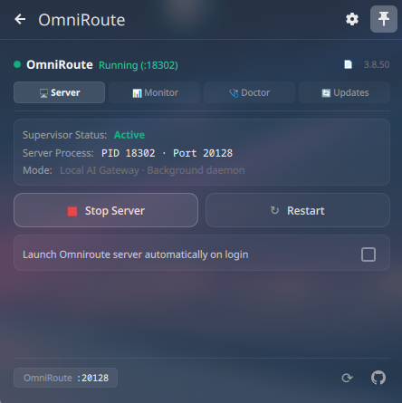
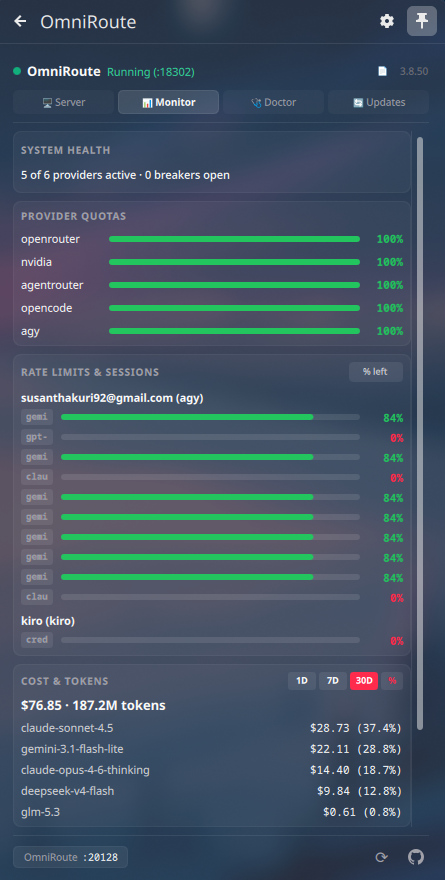
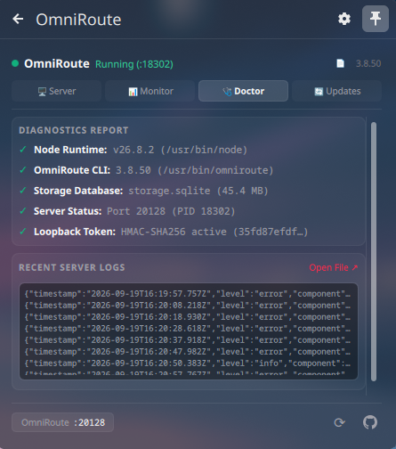
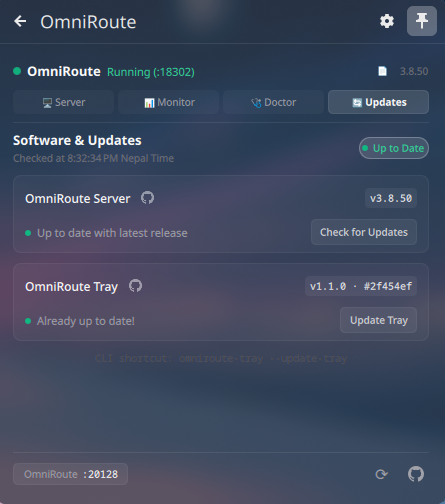

# OmniRoute Tray for Linux

<p align="center">
  
</p>

<p align="center">
  <strong>A system tray supervisor, telemetry dashboard, diagnostics tool, and auto-updater for <a href="https://github.com/diegosouzapw/OmniRoute">OmniRoute</a> on Linux.</strong>
</p>

<p align="center">
  <a href="https://github.com/Susanthakuri92/omniroute-tray-linux/actions/workflows/ci.yml"></a>
  <a href="#features"></a>
  <a href="#requirements"></a>
  <a href="#requirements"></a>
  <a href="#license"></a>
</p>

---

OmniRoute Tray provides desktop management, telemetry, and diagnostics for OmniRoute on Linux. It includes:

1. **Native KDE Plasma 6 Widget (Plasmoid)** — integrated directly into your KDE panel or system tray (runs on native QML; no PySide6 or Electron required).
2. **Universal Qt Tray (PySide6)** — for GNOME, XFCE, Cinnamon, MATE, LXQt, and Wayland/X11 compositors (Hyprland, Sway, i3).

Inspired by [zoispag/omniroute-tray](https://github.com/zoispag/omniroute-tray) (macOS).

---

## Screenshots

| 🖥️ Server Supervisor | 📊 Telemetry & Quotas |
| :---: | :---: |
| [](screenshot/Server.png) | [](screenshot/Monitor.png) |
| 🩺 Diagnostics & Logs | 🔄 Updates Center |
| [](screenshot/Doctor.png) | [](screenshot/Updates.png) |

---

## Features

- **Process Supervision**: Start, stop, and restart OmniRoute; automatically adopts existing running instances.
- **Provider Status & Health**: Live status badge showing active providers and circuit breaker states.
- **Usage & Quotas**: Visual meters for Claude, OpenAI, Gemini, and custom providers with reset countdowns.
- **Analytics & Spend**: Spend breakdown by model across 24h, 7d, and 30d with token and percentage toggles.
- **System Diagnostics**: Built-in health checks for Node.js runtime, OmniRoute CLI, and database connectivity.
- **Live Logs**: Real-time log viewer with quick access to log files.
- **Updates Center**: Check for OmniRoute CLI and Tray updates with one-click self-updating.
- **Autostart & Integration**: Native desktop system tray integration with optional startup on login.

---

## Requirements

- **Linux** (X11 or Wayland) with a system tray or panel.
- **Python 3.10+**.
- **OmniRoute** installed and accessible on your `PATH`.
- *For GNOME / XFCE / Tiling WMs only*: `python3-pyside6` (not needed on KDE Plasma).

---

## Installation

Choose either the automated installer or the manual steps below:

### Method 1: Automated Installer (Quickest)

Run the installer from your terminal:

```bash
curl -fsSL https://raw.githubusercontent.com/Susanthakuri92/omniroute-tray-linux/main/install.sh | bash
```

*Or, if you already have the repository cloned locally:*
```bash
./install.sh
```

The script automatically detects your desktop environment, links the widget or executable, and creates application menu shortcuts.

---

### Method 2: Manual Installation (By Hand)

First, clone and enter the directory (or `cd contrib/omniroute-tray-linux` if inside the OmniRoute repository):

```bash
git clone https://github.com/Susanthakuri92/omniroute-tray-linux.git
cd omniroute-tray-linux
```

#### A. KDE Plasma 6 (Native Widget)

KDE Plasma loads user widgets directly from `~/.local/share/plasma/plasmoids`. Simply link the widget folder:

```bash
mkdir -p ~/.local/share/plasma/plasmoids
ln -sfn "$(pwd)/org.omniroute.plasmoid" ~/.local/share/plasma/plasmoids/org.omniroute.plasmoid
systemctl --user restart plasma-plasmashell
```

*Then right-click your panel → **Add Widgets…** → drag **OmniRoute** onto your panel or system tray.*

#### B. Other Desktops (GNOME, XFCE, i3, Waybar)

1. **Install PySide6:**
   - **Debian / Ubuntu:** `sudo apt install python3-pyside6`
   - **Fedora:** `sudo dnf install python3-pyside6`
   - **Arch Linux:** `sudo pacman -S python-pyside6`
   *(GNOME users: enable the `AppIndicator` extension for top bar tray icons).*

2. **Link the executable:**
   ```bash
   chmod +x omniroute_tray.py
   mkdir -p ~/.local/bin
   ln -sf "$(pwd)/omniroute_tray.py" ~/.local/bin/omniroute-tray
   ```

3. **Launch:**
   ```bash
   omniroute-tray &
   ```

---

## CLI Reference

`omniroute-tray` can also be used as a CLI utility:

| Command | Action |
| :--- | :--- |
| `omniroute-tray --start` | Start the OmniRoute server daemon in background |
| `omniroute-tray --stop` | Gracefully stop OmniRoute processes |
| `omniroute-tray --restart` | Restart the OmniRoute server daemon |
| `omniroute-tray --cost --range 30d` | JSON dump of 30-day spend by model (also `1d`, `7d`) |
| `omniroute-tray --snapshot` | Full telemetry JSON snapshot (health, quotas, rates, cost) |
| `omniroute-tray --update-tray` | Pull latest code from GitHub and sync widgets |
| `omniroute-tray --toggle-autostart` | Toggle start on desktop login |

---

## Updating

- **Via GUI**: Open the **Updates** tab in the tray popup and click **Check for Tray Updates**.
- **Via CLI**: Run `omniroute-tray --update-tray`.

---

## Uninstallation

To remove OmniRoute Tray:

```bash
./uninstall.sh
```

Pass `--purge` to also delete configuration and log files:
```bash
./uninstall.sh --purge
```

---

## Troubleshooting

- **GNOME: No tray icon visible**  
  GNOME hides tray icons by default. Install and enable the `gnome-shell-extension-appindicator` extension.
- **KDE Plasma: Changes not showing after update**  
  Clear the QML cache and reload the shell:
  ```bash
  rm -rf ~/.cache/plasmashell/qmlcache ~/.cache/qmlcache
  systemctl --user restart plasma-plasmashell
  ```

---

## License

Released under the [MIT License](LICENSE).
